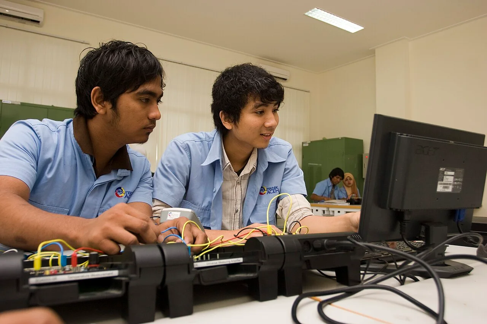
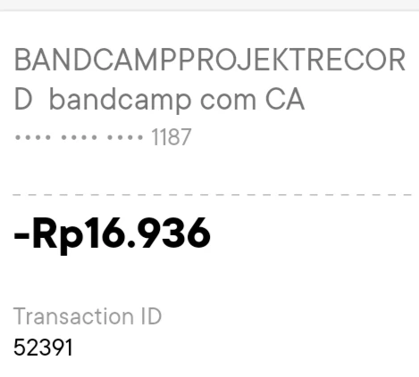
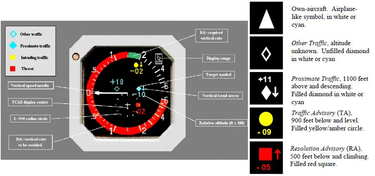

# Materi Pembelajaran NUSA Lab

Materi lengkap yang digunakan di aplikasi NUSA Lab. Setiap pelajaran berisi bacaan, visual, latihan, pembahasan, dan cek pemahaman berdasarkan sumber yang tercantum.

---

## Kelas 1: AI Fundamentals

**Label kelas:** KURSUS 01 · DASAR-DASAR AI

**Gambaran kelas:** AI sudah muncul dalam banyak aktivitas sehari-hari, dari filter email dan rekomendasi musik sampai riset dan tugas kuliah. Kelas ini membahas apa yang bisa dilakukan AI, cara kerja dasarnya, dan kapan hasilnya perlu diperiksa.

**Peta belajar:** Mulai dari contoh AI yang dekat dengan kehidupan sehari-hari, lanjut ke cara kerja dasar AI dan machine learning, lalu pelajari cara menilai hasil AI tanpa menyerahkan keputusan sepenuhnya kepada sistem.

**Ringkasan katalog:** Kenali kemampuan AI, pahami cara kerja dasarnya, dan pelajari kapan hasilnya perlu diverifikasi sebelum dipakai.

**Ilustrasi pembuka:** Mahasiswa Politeknik Aceh mempraktikkan keterampilan teknologi komputer di laboratorium. [Foto: USAID Indonesia · domain publik](https://commons.wikimedia.org/wiki/File:Mahasiswa_i_menggunakan_komputer_untuk_meningkatkan_keterampilan_teknologi_(8315664069).jpg).

### Pelajaran 1: AI Hari Ini

**Pertanyaan utama:** Seberapa jauh kemampuan AI sekarang?

AI sudah dipakai di banyak layanan sehari-hari, tetapi tugasnya tidak selalu sama. Ada sistem yang menyaring spam, memberi rekomendasi, membuat konten, membantu membaca gambar medis, sampai mengendalikan robot. Di pelajaran ini, kita akan melihat apa yang sudah bisa dilakukan AI sekaligus kapan hasilnya masih perlu diperiksa manusia.

#### 1.1 AI ada di lebih banyak tempat daripada yang kita kira

Kita sering memakai fitur berbasis AI tanpa perlu memikirkan teknologi di baliknya. Filter spam membantu memisahkan email spam dari inbox utama, aplikasi musik memberi rekomendasi lagu, dan chatbot menghasilkan jawaban berdasarkan prompt yang kita berikan. Masing-masing memakai AI untuk tugas yang berbeda.

**Generative AI**, misalnya, membuat konten baru seperti teks atau gambar. Di bidang lain, AI membantu radiolog membaca gambar medis, ilmuwan memprediksi bentuk protein, dan robot menyesuaikan gerakannya.

Jadi, AI bukan hanya chatbot atau generator gambar. Istilah ini mencakup banyak jenis sistem dengan tugas yang berbeda. Sebelum masuk ke definisi dan cara kerjanya, kita lihat dulu beberapa contoh nyata beserta batasnya.

**Catatan penting:** sistem yang berhasil pada satu tugas belum tentu selalu benar, aman, atau cocok dipakai untuk tugas lain.

**Contoh penggunaan AI di beberapa bidang**

- **Sehari-hari:** Filter email membantu memisahkan pesan spam; aplikasi musik merekomendasikan lagu.
- **Sains:** AI membantu memprediksi bentuk protein dan menyelesaikan soal matematika.
- **Kesehatan:** AI membantu radiolog memeriksa gambar hasil mammografi.
- **Robot dan tugas digital:** Robot bisa dilatih bergerak; sistem AI juga bisa memakai alat digital untuk mengerjakan beberapa langkah.

 

**Visual:** Logo ChatGPT dari [OpenAI](https://commons.wikimedia.org/wiki/File:ChatGPT-Logo.svg) dan ikon Gemini dari [Google](https://commons.wikimedia.org/wiki/File:Google_Gemini_icon_2025.svg).

#### 1.2 Dari soal matematika hingga penemuan ilmiah

Kemampuan AI juga terlihat pada tugas yang jauh lebih kompleks. Di International Mathematical Olympiad 2025, versi khusus Gemini Deep Think menyelesaikan lima dari enam soal dan memperoleh **35 dari 42 poin**, setara standar medali emas.

Soalnya diberikan dalam bahasa alami dan jawabannya harus berupa pembuktian matematika. Pada kompetisi itu, model mampu menyelesaikan sebagian besar soal yang diberikan.

Keberhasilan pada kompetisi itu tidak berarti AI berpikir seperti manusia atau akan selalu benar saat mengerjakan soal matematika.

Contoh lain ada di bidang biologi. Bentuk tiga dimensi protein memengaruhi cara protein bekerja, dan **AlphaFold2 membantu memprediksi struktur tiga dimensinya dari urutan asam amino**.

Demis Hassabis dan John Jumper menerima separuh Hadiah Nobel Kimia 2024 atas pengembangan AlphaFold2.

Dalam kasus ini, AI membantu ilmuwan mempelajari struktur protein. AlphaFold2 bukan obat dan tidak menyembuhkan penyakit secara langsung.

**Sumber bacaan**

- [Google DeepMind · IMO 2025](https://deepmind.google/blog/advanced-version-of-gemini-with-deep-think-officially-achieves-gold-medal-standard-at-the-international-mathematical-olympiad/)
- [Nobel Prize · AlphaFold2](https://www.nobelprize.org/prizes/chemistry/2024/jumper/facts/)

**Visual:** Contoh struktur tiga dimensi protein yang diprediksi AlphaFold. [AlphaFold · CC0](https://commons.wikimedia.org/wiki/File:AF-P0CH12-F1.png).

#### 1.3 AI untuk membantu pemeriksaan medis

Di bidang kesehatan, AI juga dipakai untuk membantu pemeriksaan. Salah satu contohnya adalah mammogram, yaitu gambar hasil pemeriksaan payudara. AI bisa membantu radiolog menandai gambar yang perlu diperiksa lebih teliti. Karena kesalahan medis bisa berdampak besar, manfaat AI perlu dinilai bersama risikonya, termasuk apakah penggunaannya membuat lebih banyak pasien harus menjalani pemeriksaan lanjutan.

Sebuah uji klinis yang terbit pada Maret 2026 melibatkan **31.301 perempuan**. Pada strategi yang diuji, tugas membaca gambar oleh radiolog berkurang 63,6% dan tingkat deteksi kanker naik 15,2% dibanding strategi standar.

Namun proporsi pasien yang diminta datang lagi untuk pemeriksaan lanjutan ikut naik. Angka pastinya ada di latihan di bawah.

Angka-angka ini berasal dari studi dan alur kerja tertentu. Hasilnya belum tentu sama jika sistem dipakai di rumah sakit, populasi, atau prosedur pemeriksaan yang berbeda.

Kesimpulan yang tepat bukan ‘AI lebih baik daripada dokter’, melainkan bahwa cara manusia dan AI bekerja bersama harus dirancang serta dievaluasi dengan cermat.

**Semakin besar akibat sebuah kesalahan, semakin penting pengawasan manusia.**

**Sumber bacaan**

- [Nature Medicine · uji mammogram 2026](https://www.nature.com/articles/s41591-026-04277-x)

**RINGKASAN HASIL STUDI: 31.301 perempuan**

Dalam studi pemeriksaan payudara ini, AI mengurangi jumlah gambar yang perlu dibaca radiolog, tetapi lebih banyak pasien juga diminta menjalani pemeriksaan lanjutan.

- **−63,6%:** Jumlah pembacaan gambar yang perlu dilakukan radiolog berkurang dalam strategi yang diuji.
- **+15,2%:** Tingkat deteksi kanker meningkat dibanding strategi standar.

**Visual:** Mesin pemeriksaan mammografi di ruang pemeriksaan. Mesin mammografi mengambil gambar yang kemudian diperiksa radiolog. Foto: Bill Branson / National Cancer Institute. [Public domain · NCI](https://commons.wikimedia.org/wiki/File:Mammography_machine.jpg).

**Latihan interaktif**

Deteksi kanker naik 15,2%. Menurutmu, berapa persen kenaikan pasien yang diminta datang kembali untuk pemeriksaan lanjutan?

Rentang tebakan: 0–40 persen (langkah 0.1).

**Jawaban:** 14.8 persen. Toleransi latihan: ±4.

**Pembahasan:** Pasien yang dipanggil kembali naik 14,8%. Manfaat dan beban tambahan datang bersamaan, jadi satu angka saja tidak cukup untuk menilai sebuah sistem.

**Sumber latihan:** [Studi pemeriksaan payudara](https://doi.org/10.1016/S1470-2045(23)00298-X)

#### 1.4 AI bisa memproses lebih dari teks

Interaksi dengan AI tidak lagi terbatas pada teks. Banyak sistem sekarang bisa menerima gambar, tangkapan layar, dokumen, suara, atau video sebagai bagian dari input. Ini berguna ketika sebuah masalah lebih mudah ditunjukkan daripada dijelaskan panjang lewat chat.

Pengenalan wajah, mengubah suara menjadi teks (transkripsi), dan deteksi objek sudah lama digunakan. Sistem yang menggabungkan beberapa jenis input sekaligus **disebut multimodal**.

Misalnya, saat muncul pesan error di laptop, kamu bisa mengirim tangkapan layar agar AI bisa membaca pesan error itu. Untuk masalah pada perangkat fisik, foto atau kamera juga bisa memberi konteks yang sulit dijelaskan hanya dengan kata-kata.

Meski begitu, ‘memproses gambar’ **bukan berarti AI melihat dan memahami dunia persis seperti manusia**. Periksa petunjuk resmi perangkat sebelum mengikuti saran yang berisiko.

**MULTIMODAL: Input AI tidak hanya teks**

- **Gambar:** Foto atau kamera bisa menunjukkan keadaan yang sulit dijelaskan hanya dengan kata-kata.
- **Suara:** AI bisa mengubah ucapan menjadi teks atau mengenali pola suara.
- **Video:** AI bisa memproses gerakan dan urutan kejadian dalam video.
- **Dokumen:** Isi PDF atau tampilan layar bisa dipakai sebagai konteks saat bertanya.

#### 1.5 Dari layar ke dunia fisik

Saat AI dipakai untuk mengendalikan sistem di dunia fisik, kesalahan prediksi bisa langsung memengaruhi tindakan. Pada sistem bantuan mengemudi, misalnya, kamera dan sensor membaca marka jalan, kendaraan, pejalan kaki, dan lampu lalu lintas sebelum sistem membantu menentukan apakah kendaraan perlu mengerem atau berbelok.

Tesla menyebut Full Self-Driving sebagai sistem yang **tetap membutuhkan pengemudi yang memperhatikan jalan**. Nama produknya tidak mengubah tanggung jawab pengemudi.

Kesalahan di dunia fisik bisa berakibat jauh lebih serius daripada jawaban chatbot yang keliru.

Membuat robot dari karakter animasi seperti Olaf punya tantangan sendiri. Gerakan yang terlihat natural di film belum tentu mudah dilakukan oleh robot sungguhan sambil tetap menjaga keseimbangan.

Untuk melatih gerakannya, peneliti menggunakan proses belajar melalui percobaan dan umpan balik, dengan animasi sebagai referensi. Gerakan kemudian dicoba berkali-kali di simulasi sebelum diterapkan pada robot sungguhan.

Peneliti juga perlu memperhitungkan hal yang sangat praktis, seperti bunyi langkah dan panas motor. Dengan simulasi, gerakan bisa diuji berulang kali sebelum dicoba langsung pada robot sungguhan.

Dalam riset AI fisik juga ada gagasan **world model**: model yang mencoba memperkirakan bagaimana lingkungan berubah ketika suatu tindakan dilakukan.

Untuk sekarang, cukup pahami fungsi dasarnya. Detail teknis tentang cara membangun world model belum perlu dibahas di bagian ini.

**Sumber bacaan**

- [Tesla · Full Self-Driving (Supervised)](https://www.tesla.com/support/fsd)
- [Disney Research · robot Olaf](https://la.disneyresearch.com/publication/olaf-bringing-an-animated-character-to-life-in-the-physical-world/)

**AI FISIK: Dari percobaan ke tindakan**

- **Amati:** Kamera atau sensor menangkap kondisi di sekitar robot.
- **Perkirakan:** Model memperkirakan akibat dari tindakan yang akan dicoba.
- **Uji:** Gerakan bisa dicoba dalam simulasi sebelum diuji pada robot sungguhan.
- **Awasi:** Manusia memeriksa apakah perilaku robot cukup aman di dunia nyata.

**Visual:** Robot Olaf berdiri di jalan bersalju dalam proyek Disney Research. Robot Olaf belajar berjalan dengan reinforcement learning dan diuji lewat simulasi. Foto: Disney Research. [Disney Research](https://la.disneyresearch.com/publication/olaf-bringing-an-animated-character-to-life-in-the-physical-world/).

**Latihan interaktif**

Susun urutan kerja robot sebelum sebuah gerakan dijalankan di dunia nyata.

**Pilihan**

- Uji: coba gerakan dalam simulasi
- Amati: tangkap kondisi sekitar dengan sensor
- Awasi: manusia menilai keamanannya
- Perkirakan: hitung akibat tindakan

**Petunjuk:** Pikirkan informasi apa yang dibutuhkan untuk memperkirakan gerakan, lalu bedakan uji virtual dari pemeriksaan sebelum tindakan nyata.

**Urutan jawaban:** Amati: tangkap kondisi sekitar dengan sensor → Perkirakan: hitung akibat tindakan → Uji: coba gerakan dalam simulasi → Awasi: manusia menilai keamanannya

**Pembahasan:** Amati → Perkirakan → Uji → Awasi. Gerakan dicoba di simulasi sebelum diterapkan pada robot sungguhan, lalu manusia tetap memeriksa apakah hasilnya aman.

#### 1.6 Dari menjawab ke melakukan

Chatbot biasanya digunakan untuk berdiskusi, meminta penjelasan, atau mencari ide. Kamu mengirim pertanyaan, lalu chatbot memberikan jawaban di percakapan. **AI agent** melangkah lebih jauh: agent bisa diberi tujuan, merencanakan langkah, memakai alat yang tersedia, membaca hasil tindakan sebelumnya, lalu menyesuaikan langkah berikutnya.

Perbedaannya lebih jelas saat masalah tidak bisa selesai hanya dengan saran lewat chat. Jika sebuah project di laptop mengalami error, agent yang punya akses ke file dan terminal bisa memeriksa project langsung, bukan hanya memberi daftar langkah yang harus kamu coba sendiri.

Dalam tugas coding, misalnya, agent bisa membaca file project, mencari penyebab test gagal, mengubah kode setelah mendapat izin, menjalankan test, lalu melihat apakah perbaikannya berhasil.

Perbedaan sederhananya: chatbot sering mengikuti pola tanya → jawab; AI agent mengikuti tujuan → rencana → tindakan → pemeriksaan.

Karena agent bisa melakukan tindakan langsung, izin dan hasil kerjanya perlu diawasi lebih ketat—terutama jika agent bisa mengubah data, menjalankan perintah, atau mengirim sesuatu.

**Perbedaan chatbot dan AI agent**

- **Chatbot:** Chatbot menerima pertanyaan, lalu memberi jawaban atau saran dalam percakapan.
- **AI agent:** AI agent menerima tujuan, menyusun langkah, memakai alat, lalu memeriksa hasilnya.

**Diagram:** Chatbot biasanya berhenti setelah memberi jawaban. Agent bisa melanjutkan dengan menyusun rencana, memakai tool, dan memeriksa hasilnya. Kamu tetap yang menilai hasil akhirnya.

Agent menerima tujuan, merencanakan langkah, memakai alat, lalu memeriksa hasilnya. Jika hasilnya belum sesuai, agent bisa mengulangi langkah-langkah ini.

#### 1.7 Bukti yang terlihat meyakinkan belum tentu asli

AI membuat gambar dan suara palsu semakin mudah dibuat dengan hasil yang terlihat meyakinkan. Misalnya, saat menjual tiket konser, kamu menerima tangkapan layar bertuliskan ‘transfer berhasil’. Nama, nominal, dan waktunya bisa terlihat benar, tetapi tangkapan layar itu belum membuktikan bahwa uang benar-benar masuk.

Yang perlu diperiksa adalah **riwayat transaksi di aplikasi bankmu sendiri**, bukan sekadar mencari font yang terlihat aneh.

OJK pernah memperingatkan pemalsuan bukti transfer dengan bantuan AI. Cara verifikasi yang lebih andal adalah memeriksa sumber aslinya.

Prinsip yang sama berlaku untuk identitas. Suara teman yang meminta uang lewat telepon bisa saja ditiru, begitu pula wajah di video.

Jika permintaannya penting atau mendesak, hubungi orang itu melalui kanal lain yang sudah kamu percayai. Jangan menjadikan ‘terdengar seperti suara asli’ sebagai satu-satunya bukti.

**Sumber bacaan**

- [OJK · bukti transfer palsu](https://ojk.go.id/id/Publikasi/Info-Hoax/Pages/Waspada-Pemalsuan-Bukti-Transfer-Menggunakan-AI.aspx)
- [OJK · penipuan suara dan wajah](https://ojk.go.id/id/berita-dan-kegiatan/info-terkini/Pages/Satgas-PASTI-Imbau-Masyarakat-Waspadai-Penipuan-Menggunakan-AI.aspx)

**Contoh sehari-hari: bukti pembayaran tetap perlu diverifikasi**

Di warung atau toko online, bukti transfer atau QRIS bisa diedit. Cek mutasi rekening atau status pembayaran di aplikasi merchant sebelum menyerahkan barang.

**Visual:** Contoh struk digital Bank Jago dengan nomor rekening disamarkan. Struk seperti ini tetap perlu dicocokkan dengan mutasi rekening atau status pembayaran di aplikasi merchant. [VulcanSphere · public domain](https://commons.wikimedia.org/wiki/File:Example_of_PAN_truncation_in_digital_receipt.webp).

**Renungkan:** Kalau bukti transfer terlihat asli, apa yang masih perlu dicek?

**Jawaban:** Periksa riwayat transaksi di aplikasi bankmu. Gambar bukti transfer bisa dipalsukan, sedangkan catatan transaksi bank menunjukkan apakah uangnya benar-benar masuk.

#### 1.8 Risiko gambar palsu bagi orang lain

Gambar, audio, atau video yang dibuat atau dimanipulasi dengan AI sering disebut **konten sintetis**. Konten seperti ini tidak hanya bisa dipakai untuk penipuan finansial, tetapi juga bisa merugikan orang yang wajah atau identitasnya digunakan. Misalnya, foto seseorang diubah menjadi poster seolah-olah ia mengumumkan sesuatu yang tidak pernah ia katakan. Jika orang lain percaya dan ikut menyebarkannya, reputasi orang tersebut bisa rusak, privasinya bisa terganggu, dan ia bisa merasa tidak aman.

Minta izin sebelum memakai foto orang lain, dan periksa asal gambar sebelum membagikannya.

Masalah yang sama bisa muncul pada bukti transfer, pengumuman kampus, atau informasi kesehatan. Sebelum percaya atau membagikannya, cari sumber asli dan pikirkan siapa yang bisa dirugikan jika informasi itu ternyata salah.

**Dampak pada orang yang identitasnya digunakan**

Gambar atau video palsu bisa merusak privasi, reputasi, dan rasa aman orang yang menjadi korban.

#### 1.9 Perhatikan juga data yang kita berikan

Saat memakai AI, kita tidak hanya mengirim teks prompt. PDF, foto, suara, rekaman layar, kode, dan dokumen kerja yang diunggah juga ikut dikirim ke layanan AI. Karena itu, periksa isi file sebelum mengunggahnya.

**Sebelum mengunggah, tanyakan:** data apa yang akan saya kirim, apakah saya berhak membagikannya, layanan apa yang akan menerima data itu, untuk apa data digunakan, berapa lama data disimpan, dan apakah semua informasi di dalamnya memang diperlukan?

Kalau AI tidak membutuhkan seluruh dokumen, kirim hanya bagian yang relevan. Hapus dulu nama, nomor identitas, alamat, nomor rekening, atau informasi pribadi lain yang tidak diperlukan untuk menjawab pertanyaanmu.

Setiap layanan punya kebijakan data yang berbeda. Aturannya juga bisa berbeda menurut jenis akun dan pengaturan yang kamu pilih.

Di ChatGPT, pengguna akun pribadi bisa mematikan **Improve the model for everyone** agar percakapan baru tidak digunakan untuk melatih model. Untuk akun organisasi seperti ChatGPT Business, Enterprise, dan Edu, OpenAI menyatakan bahwa konten pengguna tidak digunakan untuk melatih model secara default.

Di Gemini, pengaturan **Keep Activity** menentukan apakah percakapan baru disimpan ke akun dan bisa digunakan untuk meningkatkan model. Jika Keep Activity dimatikan, percakapan baru tidak digunakan untuk training model kecuali kamu memilih mengirim feedback.

**Periksa pengaturan produk yang sedang kamu pakai**, terutama sebelum mengirim data orang lain atau data rahasia.

**Sumber bacaan**

- [OpenAI · Data Controls](https://help.openai.com/en/articles/7730893-data-controls-in-chatgpt)
- [Google · Gemini Privacy Hub](https://support.google.com/gemini/answer/13594961)

**Sebelum mengunggah data ke layanan AI**

- **Data apa?** Pilih hanya data yang diperlukan untuk tugasmu.
- **Punya izin?** Pastikan kamu boleh membagikan data milik orang lain atau tempat kerja.
- **Dikirim ke siapa?** Pastikan kamu tahu layanan apa yang menerima datanya dan bagaimana layanan itu menggunakannya.
- **Disimpan berapa lama?** Periksa berapa lama data disimpan dan apakah ada pengaturan untuk menghapus atau membatasi penggunaannya.

#### 1.10 AI juga bisa salah tanpa ada yang berniat menipu

AI juga bisa menghasilkan informasi salah meskipun tidak ada orang yang sedang mencoba menipu. Dalam tugas kuliah, misalnya, AI bisa memberi kutipan lengkap dengan judul sumber yang terlihat meyakinkan. Sebelum memasukkannya ke daftar pustaka, buka sumber aslinya. Judulnya bisa saja tidak ada, atau isi kutipannya berbeda dari yang ditulis AI. Jika AI menyebut aturan kampus, cek halaman resmi kampus.

**Mengulang pertanyaan ke AI yang sama tidak menggantikan verifikasi ke sumber.**

Karena AI bisa salah, penggunaannya perlu punya batas yang jelas. Klaim penting perlu diperiksa, fitur baru perlu diuji, dan tugas berisiko tinggi tetap membutuhkan pengawasan manusia.

Jangan menilai AI hanya sebagai ‘baik’ atau ‘buruk’. Lihat dulu tugasnya, siapa yang terdampak jika hasilnya salah, dan bukti apa yang tersedia untuk memeriksa hasil itu.

**Periksa klaim penting ke sumber asli**

- **Jawaban AI:** Jawaban AI bisa terdengar rapi meski angka, kutipan, atau kesimpulannya salah.
- **Sumber asli:** Buka dokumen, aturan kampus, atau penelitian asli sebelum memakai klaim penting.

**Latihan interaktif**

Kamu meminta AI merangkum aturan penggunaan AI di kampus. Ini jawabannya. Dua kalimat perlu diperiksa sebelum dipakai.

Tandai 2 bagian yang perlu diperiksa:

- Panduan kampus meminta mahasiswa menyebutkan bantuan AI pada tugas. — Bukan sasaran. Kalimat ini ada di dokumen panduan.

- Sebanyak 87% dosen menyetujui aturan ini. **(Angka tanpa sumber)** — Sasaran. Tidak ada survei yang dirujuk. Angka sepresisi ini perlu sumber yang bisa dibuka.

- Mahasiswa tetap bertanggung jawab atas isi tugasnya. — Bukan sasaran. Ini pernyataan yang konsisten dengan panduan.

- Aturan serupa sudah berlaku di seluruh kampus Indonesia sejak 2019 (Panduan Nasional AI, hlm. 12). **(Sitasi yang tidak bisa diperiksa)** — Sasaran. Judul dan nomor halamannya terdengar meyakinkan, tetapi jawaban tidak memberikan dokumen atau tautan yang bisa diperiksa. Sitasi yang terlihat rapi belum tentu benar.

**Pembahasan:** Dua bagian itu perlu dicek ke sumber aslinya: angka yang muncul tanpa rujukan, dan sitasi yang terdengar resmi tetapi tidak bisa dibuka.

#### 1.11 Apakah semua yang otomatis itu AI?

Setelah melihat berbagai kemampuan AI, penting untuk membedakannya dari otomatisasi biasa. Tidak semua sistem yang bisa mendeteksi kondisi dan mengambil tindakan otomatis menggunakan machine learning. TCAS pada pesawat, misalnya, bisa mendeteksi potensi tabrakan dan memberi pilot saran untuk naik atau turun.

Namun sistem yang mendeteksi, menghitung, dan memberi saran secara otomatis **belum tentu menggunakan machine learning atau AI modern**. Aturan yang ditulis manusia juga bisa menghasilkan perilaku yang sangat canggih.

Jadi pertanyaan untuk pelajaran berikutnya ialah: jika kemampuan mengambil keputusan otomatis saja belum cukup, apa yang sebenarnya dimaksud orang ketika mengatakan ‘AI’?

**Sumber bacaan**

- [FAA · penjelasan TCAS II](https://www.faa.gov/air_traffic/publications/aim_html/chap4_section_4.html)

**Otomatisasi dan model AI bekerja dengan cara berbeda**

- **Aturan:** Sistem mengikuti aturan yang ditulis manusia, misalnya sensor parkir yang berbunyi pada jarak tertentu.
- **Model AI:** Model machine learning belajar mengenali pola dari banyak contoh data.

#### Penutup pelajaran

**Yang perlu diingat:** Saat AI menghasilkan sesuatu yang terlihat meyakinkan, tanyakan apa yang sebenarnya berhasil dilakukan sistem dan bagian mana yang masih perlu diverifikasi. Tangkapan layar transfer, misalnya, tetap harus dicocokkan dengan riwayat bankmu.

**Cek pemahaman:** Pembeli mengirim tangkapan layar transfer yang tampak meyakinkan. Langkah paling tepat?

1. Minta nomor referensi transfer dari pembeli dan cocokkan dengan angka di tangkapan layar. — Nomor referensi dan gambar masih berasal dari pembeli; keduanya belum membuktikan uang masuk ke rekeningmu.

2. Periksa nama penerima, nominal, dan jam transfer yang tertulis pada tangkapan layar. — Detail yang tampak cocok tetap bisa muncul pada gambar yang keliru atau diubah.

3. Buka riwayat transaksi di aplikasi bankmu dan cocokkan uang yang benar-benar masuk. **(jawaban tepat)** — Tepat. Catatan di rekeningmu sendiri adalah bukti yang perlu dipakai sebelum mengirim tiket.

### Pelajaran 2: Sebenarnya, Apa Itu AI?

**Pertanyaan utama:** Apa yang membuat sebuah sistem disebut AI?

Tidak semua fitur yang tampak ‘pintar’ bekerja dengan cara yang sama. Sensor parkir bisa berbunyi saat mobil terlalu dekat dengan dinding, sementara aplikasi foto bisa mengenali objek seperti kucing. Pelajaran ini membedakan sistem berbasis aturan, machine learning, deep learning, dan generative AI agar istilah-istilah itu tidak tercampur.

#### 2.1 Otomatis belum tentu AI

Ambil contoh sensor parkir. Sensor membaca jarak, membandingkannya dengan batas yang sudah ditentukan, lalu menyalakan alarm. Sistem seperti ini bisa bekerja hanya dengan aturan yang ditulis manusia, tanpa belajar dari contoh data.

Ingat TCAS dari pelajaran pertama? Sistem pesawat itu juga menerima informasi, menghitung risiko, lalu memberi saran kepada pilot. Kemampuan otomatis yang canggih masih bisa dibangun dari logika yang dirancang manusia.

Secara sederhana: **input (data yang diterima) → aturan yang ditulis manusia → output (hasilnya)**. Aturan bisa sangat rumit dan tetap berguna.

Menyebut suatu fitur ‘pintar’ atau ‘otomatis’ belum membuktikan bahwa fitur itu memakai AI.

**Sumber bacaan**

- [FAA · TCAS II](https://www.faa.gov/air_traffic/publications/aim_html/chap4_section_4.html)

**Dua contoh cara kerja sistem**

- **Sensor parkir:** Sensor parkir berbunyi ketika kendaraan terlalu dekat dengan objek di sekitarnya.
- **Model machine learning:** Model dilatih dengan banyak contoh agar bisa mengenali pola pada data baru.

**Visual:** Diagram simbol TCAS untuk pesawat sendiri, pesawat lain, dan tingkat ancaman. Contoh sistem otomatis yang memberi peringatan saat pesawat terlalu dekat. [FAA](https://www.faa.gov/lessons_learned/transport_airplane/accidents/RA-85816).

**Renungkan:** Apakah semua sistem yang bekerja otomatis disebut AI?

**Jawaban:** Tidak. Ada sistem yang cukup mengikuti aturan yang ditulis manusia. Cara kerjanya perlu dilihat sebelum memberi label AI.

#### 2.2 Ketika aturan sulit ditulis satu per satu

Menulis aturan satu per satu mulai tidak praktis ketika pola yang ingin dikenali sangat beragam. Untuk membedakan foto kucing dan anjing, misalnya, aturan seperti ‘punya bulu’ atau ‘empat kaki’ tidak membantu banyak karena keduanya punya ciri itu.

Sudut kamera, cahaya, warna, dan bagian tubuh yang tertutup membuat daftar aturan semakin panjang.

AI adalah bidang yang mengembangkan sistem untuk tugas seperti mengenali pola, membuat prediksi, memecahkan masalah, atau menghasilkan konten.

**Machine learning adalah salah satu cara membangunnya**: berikan banyak contoh, lalu sistem menyesuaikan model untuk menangkap pola yang berguna.

Jadi AI adalah bidang yang lebih luas, sedangkan machine learning adalah salah satu pendekatannya.

**Mengapa aturan manual cepat menjadi rumit**

- **Cahaya berubah:** Foto kucing yang sama bisa tampak berbeda saat terang dan gelap.
- **Sudut kamera:** Kucing dari samping terlihat berbeda dari kucing yang menghadap kamera.
- **Sebagian tertutup:** Wajah atau tubuh hewan bisa tertutup sehingga cirinya tidak lengkap.

**Diagram:** Alih-alih menulis aturan satu per satu, model belajar memisahkan kelompok berdasarkan contoh yang diberikan. Ketika contoh berubah atau bertambah, hasil pemisahannya juga bisa berubah.

Model belajar membedakan kelompok berdasarkan pola dari contoh data. Ketika contoh baru ditambahkan, pola yang dipelajari dan prediksinya bisa ikut berubah.

#### 2.3 Data → training → model → output

Untuk pengenal kucing dan anjing, kita bisa memberi banyak foto beserta jawabannya. Saat training, sistem menyesuaikan model agar bisa membedakan pola.

Setelah itu, **foto baru menjadi input dan model membuat prediksi**.

Model tidak harus menyimpan aturan sederhana seperti ‘jika telinga segitiga, maka kucing’; hubungan yang dipelajarinya bisa jauh lebih kompleks.

Ini hanya gambaran dasar untuk memudahkan pemahaman. Tidak semua sistem AI dilatih dengan proses yang persis sama.

Intinya, kualitas data dan proses training memengaruhi kemampuan model. Saat menerima input baru, model tetap menghasilkan prediksi, dan prediksi itu bisa salah.

**Alur dasar dari data sampai prediksi**

- **Data:** Kumpulkan foto kucing dan anjing dengan label yang benar.
- **Training:** Model dilatih untuk membedakan pola dari foto-foto itu.
- **Model:** Foto baru menjadi input bagi model yang sudah dilatih.
- **Output:** Model memprediksi ‘kucing’ atau ‘anjing’; prediksi ini masih bisa salah.

**Latihan interaktif**

Susun alur melatih dan memakai sebuah model pengenal gambar.

**Pilihan**

- Model: hasil pelatihan yang siap dipakai
- Data: foto berlabel kucing dan anjing
- Prediksi: jawaban untuk foto baru
- Training: model menyesuaikan diri dari contoh

**Petunjuk:** Bedakan bahan latihan, proses belajar, hasil pelatihan, dan penggunaan hasil itu pada foto baru.

**Urutan jawaban:** Data: foto berlabel kucing dan anjing → Training: model menyesuaikan diri dari contoh → Model: hasil pelatihan yang siap dipakai → Prediksi: jawaban untuk foto baru

**Pembahasan:** Data → Training → Model → Prediksi. Model tidak diberi aturan satu per satu; ia menyesuaikan diri dari contoh yang sudah berlabel.

#### 2.4 Tiga cara belajar yang sering dibahas

Ada beberapa cara model belajar dari data. Jika setiap foto latihan sudah diberi label ‘kucing’ atau ‘anjing’, model memiliki jawaban yang bisa dipakai sebagai acuan selama training. Cara ini disebut **supervised learning**. Contoh lain ialah email yang diberi label spam atau bukan spam.

Model memakai contoh berlabel itu untuk membuat prediksi pada foto atau email baru.

Dalam **unsupervised learning**, data tidak diberi kelompok yang benar sejak awal.

Sistem mencari pola kemiripan, misalnya pelanggan yang sering belanja kecil-kecilan dan pelanggan yang jarang belanja tetapi sekali transaksi besar.

Dalam **reinforcement learning**, sistem mencoba tindakan, menerima umpan balik, lalu menyesuaikan perilaku; robot yang belajar bergerak adalah salah satu contohnya.

Ketiganya tidak perlu dihafal sebagai daftar; yang penting adalah memahami bagaimana data dan umpan balik dipakai dalam proses belajar.

**Tiga pendekatan belajar yang umum**

- **Supervised learning:** Model belajar dari contoh yang sudah diberi label, seperti email spam atau bukan spam.
- **Unsupervised learning:** Model mencari kelompok atau kemiripan dalam data yang belum diberi label.
- **Reinforcement learning:** Model mencoba tindakan dan memperbaikinya berdasarkan umpan balik.

#### 2.5 Deep learning dan data yang lebih rumit

Sebagian data lebih sulit ditangani dengan aturan sederhana. Foto terdiri dari banyak piksel, suara memiliki pola frekuensi dan waktu, makna kata bergantung pada konteks kalimat, dan video menambahkan gerakan serta urutan kejadian.

Untuk menemukan pola dalam data seperti itu, banyak sistem modern memakai **deep learning, yaitu bagian dari machine learning** yang menggunakan jaringan saraf buatan dengan banyak lapisan.

Istilah ‘saraf’ terinspirasi sejarah penelitian, tetapi jaringan itu bukan otak manusia dalam komputer. Jaringan saraf buatan adalah pendekatan matematis untuk mempelajari hubungan yang kompleks.

Deep learning membantu banyak kemajuan pada pengenalan gambar, suara, bahasa, dan robotika.

**Alur sederhana deep learning**

- **Input:** Foto, suara, atau teks menjadi data yang diproses model.
- **Lapisan model:** Jaringan saraf buatan mempelajari hubungan antarpola melalui banyak lapisan.
- **Output:** Hasilnya bisa berupa label objek pada foto, teks dari ucapan, atau prediksi lain.

**Diagram:** Training dan prediksi adalah dua fase yang berbeda. Yang kamu pakai sehari-hari adalah fase kanan, yaitu model yang sudah selesai belajar.

Training memakai banyak contoh berlabel untuk menyesuaikan model. Saat prediksi, data baru tanpa label masuk ke model yang sudah dilatih dan menghasilkan jawaban.

#### 2.6 Dari mengenali menjadi menghasilkan

Sebagian AI memperkirakan kategori atau memilih sesuatu yang relevan: filter spam memberi label, sistem rekomendasi memilih lagu, model prediksi memperkirakan risiko.

Kelompok ini sering disebut AI prediktif atau diskriminatif, bergantung pada tugasnya.

**Generative AI membuat konten baru** seperti teks, gambar, audio, video, atau kode berdasarkan input pengguna.

Keduanya berada di dalam payung AI; generative AI bukan nama lain untuk seluruh AI.

Generative AI modern banyak memakai deep learning.

Ada juga model generatif yang lebih lama dan tidak memakai deep learning. Jadi, jangan menganggap AI, machine learning, deep learning, dan generative AI selalu tersusun sebagai empat tingkat yang sederhana.

Untuk pemula, cukup tanyakan tugasnya: apakah sistem sedang mengklasifikasi, merekomendasikan, memprediksi, atau menghasilkan konten?

**Bedakan tugas prediktif dan generatif**

- **AI prediktif:** Contohnya filter spam yang memberi label atau sistem yang memperkirakan risiko.
- **Generative AI:** Contohnya model yang membuat teks, gambar, suara, video, atau kode baru.

#### 2.7 Mengapa model bahasa bisa menjawab dengan lancar?

Model bahasa bisa menghasilkan kalimat yang lancar karena dilatih pada sangat banyak contoh teks. Saat menjawab, model memproses input lalu memperkirakan bagian berikutnya berdasarkan pola yang dipelajari saat training.

Sistem modern melakukan proses ini berulang sehingga bisa menulis kalimat panjang, mengikuti instruksi, merangkum, dan membantu memecahkan masalah.

Penjelasan “memprediksi bagian berikutnya” hanya gambaran awal, bukan uraian lengkap tentang cara kerja model bahasa modern.

**Kelancaran bahasa tidak membuktikan** bahwa model memiliki pengalaman, niat, atau pemahaman seperti manusia. Bahkan jawaban yang terdengar sangat yakin bisa berisi informasi yang salah.

**Alur sederhana model bahasa**

- **Input:** Kamu mengirim prompt berisi pertanyaan dan konteks.
- **Pola yang dipelajari:** Model memakai pola bahasa yang dipelajari saat training.
- **Output:** Model menyusun jawaban bagian demi bagian berdasarkan input tadi.

**Diagram:** Model menyusun jawaban sedikit demi sedikit berdasarkan pola yang dipelajari. Proses ini bukan pemeriksaan fakta, sehingga kalimat yang terdengar lancar belum tentu benar.

Pada setiap langkah, model mempertimbangkan beberapa kemungkinan lanjutan berdasarkan pola dari data training. Proses memilih lanjutan ini bukan proses mengecek apakah sebuah fakta benar.

#### 2.8 Bagus di satu tugas belum tentu bagus di tugas lain

Kemampuan model tidak selalu konsisten di semua jenis tugas. Model bisa menyelesaikan persoalan yang terlihat sulit, tetapi tetap gagal pada permintaan yang lebih sederhana jika membutuhkan ketelitian tinggi, konteks yang tidak tersedia, atau alat yang tidak dimiliki.

Performa juga berubah menurut model, versi, dan cara pengguna memberi tugas.

Satu video yang menunjukkan kegagalan model bisa menjadi contoh, tetapi tidak membuktikan bahwa semua model akan selalu gagal pada tugas yang sama.

Kadang AI bisa berkata seolah-olah sudah membuka link, menjalankan kode, atau memeriksa sumber, padahal pada sesi itu AI tidak punya tool untuk melakukan tindakan itu.

Tanyakan apa yang benar-benar dilakukan sistem, lalu periksa bukti yang bisa kamu lihat: file yang berubah, hasil pengujian, atau halaman sumber asli.

**Jangan menganggap klaim kemampuan sebagai bukti tindakan.**

**Klaim tindakan perlu bukti**

- **Klaim:** AI mungkin mengatakan sudah membuka link atau menjalankan pengujian.
- **Bukti:** Lihat halaman yang dibuka, file yang berubah, atau hasil pengujian yang benar-benar ada.

**Diagram:** Klaim dan sitasi bisa terlihat rapi, tetapi yang penting adalah apakah sumbernya benar-benar ada dan bisa dibuka.

Jika AI memberi sitasi, buka sitasinya dan pastikan dokumennya benar-benar ada serta mendukung klaim yang dibuat. Jika sumbernya tidak bisa ditemukan, klaim itu belum terverifikasi.

#### 2.9 Merangkum istilah yang sudah dipelajari

Sistem otomatis bisa bekerja tanpa AI. Machine learning mempelajari pola dari data; deep learning adalah salah satu jenisnya; generative AI membuat konten baru.

Pada saat yang sama, model bisa salah, membuat klaim tanpa bukti, atau mengatakan seolah-olah sudah melakukan sesuatu padahal belum.

Setelah memahami istilah dasarnya, pertanyaan yang lebih berguna adalah: kapan AI membantu, bagaimana cara mengecek hasilnya, dan keputusan apa yang tidak seharusnya kita serahkan begitu saja kepada AI?

**Ringkasan istilah utama**

- **Otomatisasi:** Sistem menjalankan langkah tertentu tanpa harus dioperasikan terus-menerus.
- **Machine learning:** Model dilatih dengan data untuk mengenali pola pada contoh baru.
- **Deep learning:** Jenis machine learning yang memakai jaringan saraf buatan berlapis.
- **Generative AI:** Model membuat konten baru, misalnya teks atau gambar.

#### Penutup pelajaran

**Yang perlu diingat:** Kata ‘otomatis’ belum menjelaskan cara sebuah fitur bekerja. Cari tahu apakah fitur itu hanya mengikuti aturan yang sudah ditulis atau memakai model yang belajar dari data. Untuk hasil yang penting, tetap cek hasil akhirnya.

**Cek pemahaman:** Sebuah fitur foto bertuliskan ‘perbaiki otomatis’. Apakah fitur itu pasti memakai AI?

1. Ya, karena hasil perbaikannya bisa berbeda untuk setiap foto. — Aturan biasa pun bisa memberi hasil berbeda ketika gambar masukannya berbeda.

2. Belum dapat dipastikan; cari penjelasan tentang cara fitur itu memproses foto. **(jawaban tepat)** — Tepat. Fitur otomatis bisa memakai aturan tetap atau model yang belajar dari data.

3. Tidak, karena kata ‘otomatis’ biasanya berarti prosesnya mengikuti aturan tetap. — Nama fitur tidak cukup untuk menyingkirkan kemungkinan bahwa model AI dipakai.

### Pelajaran 3: Berpikir di Era AI

**Pertanyaan utama:** Bagaimana memakai AI tanpa menyerahkan seluruh keputusan kepada AI?

Setelah memahami kemampuan dan cara kerja dasar AI, sekarang kita masuk ke cara menggunakannya dalam pekerjaan. Misalnya, saat magang sebagai analis kamu diminta menyiapkan ringkasan untuk rapat tim. AI bisa membuat draf dengan cepat, tetapi salah satu angkanya tidak punya sumber. Kamu tetap perlu memutuskan apakah angka itu layak dipakai atau harus dibuang.

#### 3.1 Pekerjaan terdiri dari banyak tugas

Pekerjaan seperti menyiapkan rapat sebenarnya terdiri dari beberapa tugas: mencari data, membaca dokumen, menyusun slide, dan memilih rekomendasi yang bisa dijelaskan kepada tim. AI mungkin mempercepat pencarian dan draf awal, tetapi kamu tetap perlu memahami situasi tim dan mempertanggungjawabkan saranmu.

Artinya, jabatannya bisa tetap sama, tetapi **cara mengerjakan sebagian tugasnya sudah berubah**.

Daripada bertanya apakah AI akan menggantikan seluruh pekerjaan analis, lihat tugasnya satu per satu. Bagian mana yang bisa dibantu AI? Bagian mana yang membutuhkan pemahaman tentang tim, hubungan dengan orang lain, dan tanggung jawabmu sendiri?

Tugas yang jelas, berulang, dan banyak memproses informasi biasanya lebih mudah dibantu AI. Sebaliknya, keputusan yang bergantung pada konteks manusia atau bisa berdampak pada orang lain membutuhkan penilaian yang lebih hati-hati.

**Satu pekerjaan terdiri dari beberapa jenis tugas**

- **Cari informasi:** Analis membaca dokumen dan mencari data yang relevan.
- **Susun draf:** AI bisa membantu merangkum dokumen atau membuat draf presentasi.
- **Pilih rekomendasi:** Manusia menimbang konteks perusahaan sebelum memilih saran.
- **Tanggung jawab:** Manusia menjelaskan alasan keputusan dan menanggung akibatnya.

#### 3.2 Apa yang ditunjukkan data pekerjaan?

Perubahan pada tugas-tugas kerja juga terlihat dalam data pasar kerja. ILO melaporkan pada 2026 bahwa di ASEAN belum terlihat kehilangan pekerjaan besar-besaran akibat generative AI. Yang lebih sering terlihat adalah perubahan pada sebagian tugas di dalam sebuah pekerjaan.

Di Indonesia, sebagian pekerjaan memiliki tugas yang secara teknis bisa dipengaruhi AI. Sekitar 3-4% pekerjaan masuk kategori dengan tingkat paparan tertinggi. Angka keseluruhannya ada di latihan di bawah.

**Paparan** di sini berarti seberapa banyak tugas dalam suatu pekerjaan yang secara teknis bisa dipengaruhi AI. Angka ini bukan persentase orang yang pasti kehilangan pekerjaan.

**Rincian Indonesia**

Besarnya paparan berbeda menurut jenis pekerjaan.

Menurut ILO, 93,9% pekerjaan dukungan administratif di Indonesia memiliki tugas yang berpotensi terdampak generative AI, dan 67,5% masuk kategori paparan tertinggi.

Untuk pekerja muda usia 15-24 tahun, angkanya diperkirakan 26,1%, dibanding 21,1% pada pekerja dewasa. Angka ini menunjukkan bahwa sebagian tugas bisa berubah; bukan berarti pekerja muda pasti kehilangan pekerjaannya.

**Sinyal dari Amerika Serikat**

Data dari Stanford Digital Economy Lab memberi gambaran tambahan dari Amerika Serikat.

Hingga Juni 2026, jumlah pekerja usia 22-25 tahun di bidang dengan paparan AI tinggi sekitar 19% lebih rendah dari perkiraan.

Perkiraan itu membandingkan pekerja muda di bidang dengan paparan AI tinggi dengan kelompok muda di bidang yang paparannya lebih rendah. Perubahannya lebih banyak terlihat dari perekrutan yang melambat daripada dari PHK.

Studi itu tidak membuktikan bahwa AI sendirian menyebabkan seluruh selisihnya, dan hasil Amerika Serikat tidak boleh langsung dianggap sebagai prediksi Indonesia.

**Sumber bacaan**

- [ILO · pasar kerja ASEAN 2026](https://www.ilo.org/publications/generative-ai-and-labour-markets-asean-significant-exposure-limited)
- [ILO · rincian Indonesia](https://www.ilo.org/resource/article/navigating-generative-ai%E2%80%99s-transformations-asean-labour-markets)
- [Stanford Digital Economy Lab · pekerja muda](https://digitaleconomy.stanford.edu/news/canariesaug26/)

**Potensi dampak pada pekerjaan di Indonesia**

Menurut ILO, sebagian pekerjaan di Indonesia memiliki tugas yang berpotensi terdampak generative AI. Coba tebak persentasenya pada latihan di bawah. Angka ini bukan jumlah pekerja yang pasti kehilangan pekerjaan.

- **3-4%:** Sekitar 3-4% pekerjaan di Indonesia masuk kategori dengan paling banyak tugas yang bisa dipengaruhi AI.
- **26,1%:** Sekitar 26,1% pekerjaan pada kelompok usia 15-24 tahun memiliki tugas yang berpotensi terdampak AI.

**Latihan interaktif**

Menurut ILO, berapa persen pekerjaan di Indonesia yang punya sebagian tugas berpotensi terdampak generative AI?

Rentang tebakan: 0–60 persen pekerjaan (langkah 0.1).

**Jawaban:** 21.7 persen pekerjaan. Toleransi latihan: ±6.

**Pembahasan:** Sekitar 21,7%. Perhatikan kata ‘sebagian tugas’: ini bukan jumlah pekerja yang pasti kehilangan pekerjaan, melainkan pekerjaan yang sebagian tugasnya bisa berubah.

**Sumber latihan:** [ILO · potensi dampak generative AI](https://www.ilo.org/publications/generative-ai-and-jobs-refined-global-index-occupational-exposure)

#### 3.3 Apa artinya bagi mahasiswa Indonesia?

Bagi mahasiswa Indonesia, pertanyaan yang paling relevan bukan hanya ‘pekerjaan apa yang akan berubah?’, tetapi juga ‘kemampuan apa yang bisa saya bangun sekarang?’. Pengembangan AI bergantung pada banyak hal—energi, infrastruktur, chip, talenta, dan aplikasi—dan Indonesia masih membangun kemampuan di berbagai bagian tersebut.

**Tidak setiap mahasiswa perlu membuat model sebesar ChatGPT dari awal.** Jauh lebih banyak orang akan memakai AI dalam belajar, riset, desain, coding, bisnis, dan pelayanan sehari-hari.

Yang lebih penting bagi mahasiswa adalah belajar memakai AI untuk masalah nyata: tahu kapan AI membantu, informasi apa yang perlu diberikan, dan kapan hasilnya harus dicek lagi.

Menguasai nama satu alat saja tidak cukup, karena alatnya akan berubah.

**Sumber bacaan**

- [Komdigi · lima lapisan AI](https://portal.komdigi.go.id/kanal-publik/berita-kini/10477)

**Cara menerapkan AI pada kebutuhan nyata**

- **Saat belajar:** Gunakan AI untuk mencari penjelasan, lalu cek informasi pentingnya.
- **Saat riset:** AI bisa membantu membuat ringkasan awal; kamu tetap membuka sumber asli.
- **Saat berkarya:** AI bisa membantu membuat draf desain, kode, atau ide bisnis.

#### 3.4 Manusia + AI tidak otomatis lebih baik

AI tidak hanya membantu menghasilkan jawaban; cara jawabannya disampaikan juga bisa memengaruhi keputusan kita. Misalnya, kamu awalnya yakin jawaban sebuah soal adalah B, tetapi AI memilih D dengan penjelasan panjang dan terdengar meyakinkan. Jika langsung mengikuti AI tanpa memeriksa alasan dan bukti, kamu bisa meninggalkan jawaban yang sebenarnya benar.

Kebiasaan memberi kepercayaan berlebih kepada sistem otomatis disebut **automation bias**.

Eksperimen yang terbit di Nature Medicine pada 2026 melibatkan 623 orang awam dan 153 dokter layanan primer dalam tugas diagnosis kondisi kulit.

Bantuan AI yang benar bisa membantu, tetapi orang awam lebih sering mengikuti saran AI ketika sarannya salah. Dokter berpengalaman lebih jarang mengikuti saran AI yang salah.

Hasil itu tidak berarti ahli selalu benar. Intinya, pengetahuan bidang membantu kita menilai saran AI.

**Sumber bacaan**

- [Nature Medicine · AI dan keputusan diagnosis 2026](https://www.nature.com/articles/s41591-026-04553-w)

**Automation bias dalam pengambilan keputusan**

- **Langsung ikut AI:** Mengganti penilaian sendiri hanya karena penjelasan AI terdengar yakin.
- **Periksa saran AI:** Bandingkan dengan pengetahuan bidang dan bukti yang tersedia.

#### 3.5 Lima kemampuan yang tetap perlu dilatih

Dari contoh-contoh sebelumnya, ada lima kemampuan yang tetap penting saat bekerja bersama AI:

1. **Tentukan tujuan dengan jelas.** Gunakan AI untuk bagian yang memang cocok dibantu, seperti mencari ide awal, merangkum, atau membuat draf, lalu tentukan sendiri bagian yang masih membutuhkan pekerjaan manusia.
2. **Pahami bidang yang sedang dikerjakan.** Pengetahuan coding membantu melihat masalah keamanan pada kode yang dihasilkan AI; pengetahuan riset membantu mengenali asumsi yang keliru dalam ringkasan.
3. **Sesuaikan pemeriksaan dengan risikonya.** Nama acara kampus yang kurang menarik mudah diganti, tetapi ringkasan jurnal perlu dicek ke sumber asli dan keputusan kesehatan memerlukan sumber serta tenaga profesional yang tepat.
4. **Pahami konteks dan orang yang terlibat.** Keputusan tentang pelanggan, tim, atau kebijakan jarang bisa diselesaikan hanya dari informasi yang mudah dimasukkan ke prompt.
5. **Terus belajar.** Alat AI dan cara kerja di banyak bidang terus berubah, sehingga kemampuan menyesuaikan diri tetap penting.

Tidak ada daftar keterampilan yang bisa menjamin pekerjaan seseorang tidak akan terdampak AI.

Namun **kemampuan memakai alat, memahami bidang yang dikerjakan, mengecek hasil AI, memahami situasi dan orang yang terlibat, lalu terus belajar** membuat kita lebih siap menghadapi perubahan.

**Contoh manfaat yang terukur**

Ada manfaat yang terukur pada beberapa tugas.

Dalam studi atas 5.172 agen layanan pelanggan, akses ke asisten AI meningkatkan produktivitas rata-rata 15%, diukur dari jumlah masalah yang diselesaikan per jam. Besarnya manfaat berbeda antarpekerja.

Angka 15% itu berasal dari satu lingkungan kerja, jadi tidak berarti semua pekerjaan akan mendapat peningkatan yang sama. Temuannya hanya menunjukkan bahwa AI bisa membantu produktivitas ketika tugas dan cara penggunaannya memang cocok.

**Sumber bacaan**

- [OECD · AI dan keterampilan](https://www.oecd.org/en/publications/ai-and-skills_f843b352-en/full-report.html)
- [Brynjolfsson dkk. · Generative AI at Work](https://arxiv.org/abs/2304.11771)

**Lima kemampuan yang perlu terus dilatih**

- **Tentukan tujuan:** Tahu masalah apa yang ingin diselesaikan sebelum meminta bantuan AI.
- **Pahami bidangmu:** Pengetahuan bidang membantu melihat kesalahan pada hasil AI.
- **Cek sesuai risiko:** Periksa lebih teliti ketika akibat kesalahan lebih besar.
- **Pahami konteks:** Pertimbangkan orang dan situasi yang tidak terlihat dalam prompt.
- **Terus belajar:** Perbarui keterampilan saat alat dan tugas kerja berubah.

#### 3.6 Jangan menyerahkan seluruh proses berpikir

Memakai AI untuk mempercepat pekerjaan juga bisa mengubah cara kita berpikir selama mengerjakannya. Sebuah studi Microsoft Research dan Carnegie Mellon mengumpulkan 936 contoh penggunaan generative AI dari 319 pekerja pengetahuan.

Berdasarkan jawaban peserta sendiri, semakin tinggi kepercayaan mereka pada AI, semakin sedikit upaya berpikir kritis yang mereka laporkan pada tugas tertentu.

Peneliti juga menemukan bahwa ketika memakai AI, pengguna **lebih banyak memeriksa, menggabungkan, dan mengawasi hasil AI**.

Studi ini tidak membuktikan bahwa AI membuat orang menjadi kurang pintar. Namun hasilnya menunjukkan pentingnya tetap melakukan bagian pekerjaan yang membutuhkan penilaian dan pemikiran sendiri.

Bandingkan dua cara memakai AI untuk tugas kuliah. Mahasiswa pertama meminta AI mengerjakan semuanya, lalu menyalin hasilnya.

Mahasiswa kedua membuat jawabannya dahulu, meminta AI mencari kelemahannya, memeriksa umpan balik, dan memperbaiki jawabannya sendiri.

Keduanya memakai AI, tetapi cara kedua tetap membuat mahasiswa menyusun jawaban, menilai kritik, dan memperbaikinya sendiri.

**Sumber bacaan**

- [Microsoft Research · studi berpikir kritis](https://www.microsoft.com/en-us/research/publication/the-impact-of-generative-ai-on-critical-thinking-self-reported-reductions-in-cognitive-effort-and-confidence-effects-from-a-survey-of-knowledge-workers/)

**Dua pola penggunaan AI untuk belajar**

- **Serahkan semuanya:** Minta jawaban jadi, lalu salin tanpa memeriksa.
- **Minta AI mengkritik draf:** Buat jawaban awal sendiri, minta AI mencari kelemahannya, lalu periksa dan perbaiki.

#### 3.7 Empat langkah yang mudah dipakai

Untuk menangani angka tanpa sumber pada slide magang tadi, gunakan empat langkah berikut.

**TENTUKAN:** apa masalah yang sebenarnya ingin diselesaikan? Mulai dari tujuan, bukan dari merangkai prompt.

**GUNAKAN:** pilih bagian yang bisa dibantu AI, seperti mencari ide, membuat draf, merangkum, membandingkan, atau menjelaskan.

**CEK:** untuk klaim penting, angka, kutipan, dan sumber, kembali ke bukti aslinya. Semakin besar akibat jika jawaban salah, semakin teliti pemeriksaannya.

**PUTUSKAN:** AI bisa memberi pilihan dan rekomendasi, tetapi kamu menentukan apa yang dipakai dan bertanggung jawab atas hasilnya.

**Contoh proposal sponsor**

Di draf slide rapat tadi, AI menulis ‘78% Gen Z menyukai merek yang mendukung keberlanjutan’ tanpa sumber. Kalimat itu mungkin mendukung pesan yang ingin disampaikan tim, tetapi angkanya belum bisa dipertanggungjawabkan.

Cari penelitian aslinya, lihat siapa yang disurvei dan kapan. Jika tidak ditemukan atau tidak relevan, keluarkan angka itu dari slide.

**Kerangka: Tentukan → Gunakan → Cek → Putuskan**

- **Tentukan:** Apa masalah yang sebenarnya ingin kamu selesaikan?
- **Gunakan:** Bagian mana yang cocok dibantu AI?
- **Cek:** Klaim, angka, dan sumber apa yang harus dibuka lagi?
- **Putuskan:** Apa yang layak dipakai dan siapa yang bertanggung jawab?

**Renungkan:** Pada langkah mana keputusan akhir tetap ada padamu?

**Jawaban:** Pada langkah Putuskan. Kamu bisa memakai AI untuk membantu, lalu memeriksa hasil dan menentukan tindakan sesuai konteks.

#### 3.8 Bagian yang tetap membutuhkan keputusan manusia

Pada contoh pekerjaan analis, AI bisa mempercepat pembuatan ringkasan dan draf slide. Namun kamu tetap perlu menentukan tujuan, menilai kualitas hasil, dan bertanggung jawab atas keputusan yang diambil.

**Manusia tetap perlu menentukan tujuan**, memilih saran yang sesuai, menilai kualitas hasil, memahami kondisi yang tidak tertulis di prompt, dan bertanggung jawab atas keputusan akhirnya.

Ini bukan berarti kita berhenti menulis, menganalisis, atau membuat kode. Justru ketika AI ikut mengerjakan sebagian proses, kita perlu tetap memahami apa yang dihasilkan dan alasan di baliknya.

Data tadi tidak mendukung kesimpulan bahwa semua pekerjaan akan hilang. Namun perubahan pada cara kerja juga tetap perlu diperhatikan meskipun AI masih sering salah.

Gunakan AI untuk membantu pekerjaan, tetapi tetap pahami hasilnya, cek bagian yang penting, dan ambil keputusan akhirnya sendiri.

**Bagian yang tetap membutuhkan keputusan manusia**

AI bisa mempercepat pekerjaan. Kita tetap memilih arah, memahami konteks, memeriksa kualitas, dan bertanggung jawab atas hasilnya.

#### 3.9 Lanjutkan latihan dengan situasi nyata

Prinsip tadi akan dipakai lagi di NUSA Lab Game melalui situasi yang lebih konkret: kutipan dari AI yang terlihat sah, tangkapan layar yang tampak asli, data yang belum tentu boleh dibagikan, dan tugas kuliah yang bisa dikerjakan dengan bantuan AI.

Pertanyaannya bukan sekadar ‘AI baik atau buruk?’, melainkan ‘Apa yang akan kamu lakukan, dan **bukti apa yang kamu perlukan?**’

Setelah tiga pelajaran ini, gunakan pola sederhana yang sama saat belajar atau bekerja: tentukan tujuan, pakai AI jika membantu, cek bagian yang penting, lalu ambil keputusan sendiri.

**Menerapkan prinsip pada situasi nyata**

- **Kutipan dari AI:** Buka tulisan asli untuk memastikan kutipan dan sumbernya benar.
- **Bukti transfer:** Cek riwayat transaksi di aplikasi bank, bukan hanya tangkapan layar.
- **Data pribadi:** Tanya dulu apakah informasi itu boleh dikirim ke layanan AI.
- **Tugas kuliah:** Gunakan AI sebagai bantuan tanpa menyerahkan seluruh proses berpikir.

#### Penutup pelajaran

**Yang perlu diingat:** AI bisa membantu menyiapkan draf, tetapi klaim penting tetap perlu dicek ke sumber aslinya. Jika angka dalam slide tadi tidak bisa dibuktikan, coret atau ganti sebelum rapat.

**Cek pemahaman:** AI memberi statistik yang cocok untuk proposalmu, tetapi tidak menyertakan sumber. Apa langkah berikutnya?

1. Temukan sumber asli angka itu dan periksa tahun serta kelompok yang diteliti. **(jawaban tepat)** — Tepat. Angka baru layak masuk proposal setelah asal dan konteksnya jelas.

2. Tanyakan angka yang sama kepada dua AI lain dan gunakan bila jawabannya serupa. — Beberapa AI bisa mengulang angka keliru dari sumber yang sama; kesamaan jawaban belum memverifikasi klaim.

3. Cantumkan angkanya sebagai perkiraan sementara dengan catatan ‘perlu diverifikasi’. — Catatan itu jujur, tetapi statistik tanpa sumber belum kuat untuk mendukung proposal.

### Penutup kelas

Sampai di sini, kamu sudah mempelajari tiga hal: kemampuan AI saat ini, cara kerja dasarnya, dan cara mengecek hasilnya sebelum mengambil keputusan. Selanjutnya, kamu bisa mencoba prinsip yang sama lewat skenario di NUSA Lab Game.

**Lanjut:** [Coba NUSA Lab Game ↗](/games)

---

## Kelas 2: Working with Generative AI

**Label kelas:** KURSUS 02 · GENERATIVE AI

**Gambaran kelas:** Jawaban AI bisa terlalu umum, terlalu panjang, terlalu yakin, atau tidak sesuai kebutuhan. Kelas ini membahas cara memberi konteks, menguji asumsi, memperbaiki draf, dan menyusun penggunaan AI menjadi alur kerja yang lebih terarah.

**Peta belajar:** Dari prompt pertama sampai hasil akhir: beri konteks, uji asumsi, revisi draf, lalu susun pekerjaan langkah demi langkah.

**Ringkasan katalog:** Pelajari cara memberi arah pada Generative AI, menguji jawabannya, dan memperbaiki hasilnya sampai sesuai dengan kebutuhan tugas.

**Ilustrasi pembuka:** Mahasiswa bekerja bersama menyusun model arsitektur di lingkungan kampus. [Foto: DFAT · CC BY 2.0](https://commons.wikimedia.org/wiki/File:New_Colombo_Plan_students_in_Indonesia_working_on_a_student_collaboration_on_architecture_(15894268345).jpg).

### Pelajaran 1: Memberi AI Arah yang Jelas

**Pertanyaan utama:** Apa yang perlu AI ketahui?

Saat meminta AI membantu sebuah tugas, kualitas hasil sangat bergantung pada informasi yang kita berikan. Misalnya, kelompokmu harus menjelaskan risiko penggunaan AI kepada teman sekelas dalam presentasi lima menit. Jika prompt hanya berbunyi ‘buat presentasi tentang AI’, hasilnya mudah menjadi terlalu luas, terlalu panjang, atau terlalu teknis. Pelajaran ini membahas cara memberi arah yang lebih jelas sejak awal.

#### 1.1 Dari permintaan umum ke hasil terarah

Dengan prompt yang terlalu umum, AI harus menebak banyak hal sendiri. Drafnya bisa dimulai dari sejarah AI, dilanjutkan dengan istilah teknis, tetapi tidak pernah benar-benar menjawab kebutuhan presentasi. Masalahnya bukan karena AI ‘tidak pintar’, melainkan karena audiens, durasi, tujuan, dan bentuk hasil belum dijelaskan.

> Draf AI — Slide 1: Sejarah AI. Slide 2: Istilah teknis. Slide 3: Daftar teknologi. Belum ada pesan utama untuk teman sekelasmu.

Coba tambahkan konteks: ‘Saya mahasiswa yang akan menjelaskan risiko penggunaan AI kepada mahasiswa non-IT. Presentasi berlangsung lima menit. Buat outline lima slide, bahasa sederhana, maksimal tiga poin utama per slide.’

Setelah konteks ditambahkan, AI memiliki dasar yang lebih jelas untuk menentukan tingkat penjelasan dan bentuk hasil. Prinsip yang sama berlaku untuk tugas lain: semakin penting konteksnya bagi jawaban, semakin perlu konteks itu disebutkan di prompt.

**Prompt yang memberi konteks lebih jelas**

- **‘Buat presentasi tentang AI’:** Topik ada, tetapi audiens, tujuan, durasi, tingkat teknis, dan jumlah slide belum jelas.
- **Presentasi 5 menit untuk mahasiswa non-IT:** Konteks audiens dan batas waktu membantu AI menentukan tingkat penjelasan.

#### 1.2 Kerangka sederhana: Task + Context + Output

Agar AI tidak perlu menebak terlalu banyak konteks, pastikan prompt menjawab tiga hal berikut:

**Task**: apa yang ingin AI lakukan?

**Context**: apa yang perlu AI ketahui tentang situasi atau audiensnya?

**Output**: bentuk hasilnya seperti apa?

Jika perlu, tambahkan **Requirements**: batas jumlah kata, bahasa, hal yang tidak boleh ditambahkan, atau format yang harus diikuti.

Contoh: ‘Ringkas laporan ini (Task) untuk ketua organisasi mahasiswa tanpa latar teknis (Context). Sajikan dalam lima poin (Output), maksimal 150 kata dan jangan menambahkan informasi di luar laporan (Requirements).’

**Kerangka dasar prompt: Task + Context + Output**

- **Task:** Tugasnya: buat outline presentasi risiko AI.
- **Context:** Audiensnya mahasiswa non-IT yang belum banyak mempelajari AI.
- **Output:** Buat lima slide dengan maksimal tiga poin utama per slide.
- **Requirements:** Tambahkan batas bila perlu: bahasa Indonesia, maksimal 300 kata, tanpa jargon, atau hanya memakai isi dokumen.

#### 1.3 Aktivitas · kenali bagian prompt

Kerangka itu tidak hanya berlaku untuk presentasi. Pada contoh ringkasan laporan berikut, setiap potongan prompt memiliki fungsi berbeda: menjelaskan tugas, konteks pembaca, bentuk hasil, atau batas yang harus dipatuhi.

**AKTIVITAS 2: Cocokkan potongan prompt**

**Latihan interaktif**

Setiap potongan prompt punya fungsi berbeda. Cocokkan dengan kategorinya.

**Pilihan**

- ‘Identifikasi tindakan yang perlu dilakukan setelah membaca laporan ini.’
- ‘Pembacanya ketua organisasi mahasiswa yang belum akrab dengan istilah teknis.’
- ‘Susun hasilnya dalam tabel berisi temuan dan halaman sumber.’
- ‘Gunakan hanya isi laporan; batasi jawaban sampai 150 kata.’

**Kategori**

- Task
- Context
- Output
- Requirements

**Petunjuk:** Satu potongan menjelaskan bentuk jawaban; potongan lain membatasi bahan dan panjangnya.

**Pasangan jawaban:**

- ‘Identifikasi tindakan yang perlu dilakukan setelah membaca laporan ini.’ → Task

- ‘Pembacanya ketua organisasi mahasiswa yang belum akrab dengan istilah teknis.’ → Context

- ‘Susun hasilnya dalam tabel berisi temuan dan halaman sumber.’ → Output

- ‘Gunakan hanya isi laporan; batasi jawaban sampai 150 kata.’ → Requirements

**Pembahasan:** Task menjelaskan apa yang harus dikerjakan, Context memberi informasi latar yang dibutuhkan, Output menentukan bentuk hasil, dan Requirements menetapkan batas yang harus dipatuhi. Kerangka ini hanya alat bantu, bukan istilah yang harus dihafal.

#### 1.4 Prompt panjang belum tentu lebih baik

Konteks yang relevan membantu, tetapi prompt tidak harus panjang. Instruksi yang tidak berkaitan dengan tugas justru bisa membuat permintaan lebih sulit dibaca dan lebih sulit diikuti. Kalau hanya ingin merangkum lima paragraf, kamu tidak perlu memberi persona panjang dan belasan aturan.

Contoh yang cukup: **‘Ringkas teks berikut menjadi lima poin. Pertahankan informasi utama dan jangan menambahkan informasi baru.’** Kata ‘Ringkas’ saja mungkin kurang jelas; instruksi tiga paragraf tentang persona ahli juga belum tentu membantu.

**Tambahkan detail hanya jika relevan**

- **Terlalu minim:** ‘Ringkas.’ Tidak menyebut bentuk atau hal yang perlu dipertahankan.
- **Cukup jelas:** Ringkas teks menjadi lima poin, pertahankan informasi utama, jangan menambahkan informasi baru.
- **Terlalu banyak:** Instruksi persona panjang yang tidak terkait tugas membuat prompt kurang fokus.

#### 1.5 Saat perlu detail atau contoh

Untuk tugas komunikasi yang lebih kompleks, informasi tentang gaya, nada, dan pembaca bisa ikut memengaruhi hasil. Misalnya, saat menulis email sponsor seminar, nada yang cocok untuk manajer pemasaran tentu berbeda dari pesan singkat untuk teman satu kelompok. Kerangka **CO‑STAR** bisa membantu: Context (latar), Objective (tujuan), Style (gaya), Tone (nada), Audience (pembaca), dan Response (bentuk hasil). Tidak semua permintaan membutuhkan keenamnya.

Contoh: minta draf email sponsor untuk seminar teknologi organisasi mahasiswa bagi 300 peserta. Jelaskan tujuan mengajak perusahaan menjadi sponsor, gunakan gaya profesional tetapi ramah, tujukan kepada manajer pemasaran, batasi 200 kata, dan akhiri dengan ajakan bertemu singkat.

Kalau sulit menjelaskan gaya, berikan contoh. **Few-shot prompting** berarti menyertakan beberapa contoh agar AI menangkap pola: ‘Satu semester, banyak eksperimen, dan lebih banyak error daripada yang mau saya akui. Tapi akhirnya selesai juga.’ serta ‘Ternyata membuat modelnya lebih mudah daripada menjelaskannya saat presentasi.’ Setelah itu, minta caption proyek baru dengan gaya ringan, singkat, dan tidak terlalu formal.

**CO-STAR dan few-shot prompting**

- **CO-STAR:** Context, Objective, Style, Tone, Audience, Response. Berguna untuk draf sponsor seminar: tujuan, pembaca, nada ramah-profesional, maksimal 200 kata, dan ajakan bertemu.
- **Few-shot prompting:** Sertakan dua caption contoh agar AI menangkap panjang, struktur, dan gaya yang diinginkan.
- **Aktivitas 4:** Umum → tambah context; format salah → tentukan output; gaya sulit dijelaskan → beri contoh; batas tertentu → tambah requirements.

#### 1.6 Aktivitas · pilih informasi yang perlu ditambah

Tidak semua hasil yang kurang tepat membutuhkan prompt yang lebih panjang. Perbaikannya tergantung masalah yang muncul. Jika hasil terlalu umum, tambahkan context. Jika bentuknya salah, tentukan output. Jika gaya sulit dijelaskan, berikan contoh. Jika ada batasan, tambahkan requirements.

Coba bandingkan: mana yang paling pas untuk meringkas teks menjadi lima poin?

**A.** ‘Ringkas teks ini menjadi lima poin dengan mengutamakan informasi yang paling baru.’

**B.** ‘Ringkas teks ini menjadi lima poin, pertahankan informasi utama.’

**C.** ‘Buat lima poin dari teks ini dan tambahkan konteks umum agar lebih lengkap.’

**Pembahasan**

**B.** Pilihan itu menyebut bentuk hasil dan menjaga gagasan utama. A mengubah prioritas menjadi ‘paling baru’ padahal teksnya belum tentu tentang waktu; C membuka ruang untuk informasi di luar sumber.

**AKTIVITAS 4: Cocokkan masalah dengan perbaikannya**

**Latihan interaktif**

Tiap keluhan tentang hasil AI punya perbaikan yang paling pas. Cocokkan.

**Pilihan**

- Ringkasannya benar, tetapi mengabaikan bahwa pembacanya siswa SMP
- Isinya sesuai, tetapi berbentuk paragraf panjang saat kamu perlu tabel
- Caption sudah sesuai topik, tetapi masih kaku meski kamu meminta gaya santai
- Jawabannya melewati batas jumlah kata dari dosen

**Kategori**

- Tambah context
- Tentukan output
- Beri contoh
- Tambah requirements

**Petunjuk:** Pilih tambahan prompt yang menyelesaikan masalah pada hasil, bukan yang sekadar membuat instruksinya lebih panjang.

**Pasangan jawaban:**

- Ringkasannya benar, tetapi mengabaikan bahwa pembacanya siswa SMP → Tambah context

- Isinya sesuai, tetapi berbentuk paragraf panjang saat kamu perlu tabel → Tentukan output

- Caption sudah sesuai topik, tetapi masih kaku meski kamu meminta gaya santai → Beri contoh

- Jawabannya melewati batas jumlah kata dari dosen → Tambah requirements

**Pembahasan:** Hasil yang terlalu umum membutuhkan context; bentuk yang salah perlu output yang lebih jelas; gaya yang sulit dijelaskan lebih mudah ditunjukkan lewat contoh; dan batasan perlu ditulis sebagai requirements.

#### Penutup pelajaran

**Yang perlu diingat:** Untuk presentasi lima menit, sebutkan siapa audiensnya, pesan utama yang harus dipahami, dan berapa slide yang kamu butuhkan. Detail yang relevan membuat draf lebih mudah dipakai.

**Cek pemahaman:** Kamu sudah menyebut audiens dan meminta caption santai, tetapi hasilnya masih formal. Apa langkah paling berguna?

1. Minta AI mengganti kata-kata baku dengan istilah sehari-hari tanpa mengubah kalimatnya. — Kata yang lebih santai belum tentu membuat ritme dan gaya keseluruhan terasa alami.

2. Berikan dua contoh caption yang terasa pas, lalu minta AI meniru gaya tanpa menyalin isinya. **(jawaban tepat)** — Tepat. Contoh menunjukkan nada dan bentuk yang sulit dijelaskan hanya dengan satu kata seperti ‘santai’.

3. Tambahkan daftar istilah gaul yang harus muncul di setiap kalimat. — Istilah gaul bisa membuat caption terdengar dipaksakan, sementara masalahnya ada pada gaya keseluruhan.

### Pelajaran 2: Jangan Biarkan AI Cuma Mengiyakan

**Pertanyaan utama:** Apakah AI sedang menguji ide kamu?

AI bisa terdengar sangat mendukung jika pertanyaan kita sejak awal meminta persetujuan. Misalnya, saat menilai ide layanan pencarian karier bagi mahasiswa, pertanyaan ‘Ide ini bagus, kan?’ cenderung menghasilkan alasan yang mendukung. Jika kita justru meminta kelemahan, asumsi, dan bukti yang masih kurang, AI akan lebih banyak membahas bagian-bagian tersebut.

#### 2.1 Cara bertanya bisa membuat AI terlalu mendukung ide kita

Mulai dari dua cara bertanya tentang ide yang sama. Pertanyaan ‘Ide ini menarik, kan?’ sudah meminta persetujuan sejak awal, sehingga respons bisa lebih banyak menonjolkan sisi positif.

Lalu kamu bertanya, ‘Apa kelemahan ide ini, siapa yang mungkin tidak membutuhkannya, dan bukti apa yang perlu saya cari?’ Jawabannya bisa berubah menjadi daftar risiko dan cara menguji ide.

**Keduanya bukan bukti bahwa AI sudah tahu ide mana yang benar.** Bentuk pertanyaan memberi arah pada percakapan.

**Pertanyaan berbeda bisa mengarahkan jawaban berbeda**

- **Minta dukungan:** Pertanyaan yang mencari persetujuan cenderung mengarahkan percakapan untuk mendukung ide.
- **Minta pengujian:** Pertanyaan netral membuka ruang untuk risiko, bukti, dan informasi yang belum ada.

#### 2.2 Saat AI terlalu mudah menyetujui

Jika AI terus memuji ide layanan karier tanpa menanyakan siapa yang benar-benar membutuhkannya, penilaiannya belum seimbang. Kecenderungan model mengikuti pandangan atau keinginan pengguna disebut **sycophancy**. Dalam bahasa sehari-hari, AI bisa menjadi yes-man: terdengar mendukung, tetapi kurang menguji apakah kita benar.

Pada April 2025, OpenAI membatalkan pembaruan GPT‑4o setelah model dinilai terlalu menyetujui dan memuji pengguna. Riset yang terbit di Science pada 2026 menguji 11 model dan 2.405 orang; model rata-rata 49% lebih sering membenarkan pengguna daripada manusia. Dalam contoh unggahan Reddit yang pendapat manusianya menolak pengguna, model tetap menyetujui pengguna pada 51% kasus.

Kalau kita hanya mencari dukungan, jawaban yang menyenangkan bisa membuat kita makin yakin tanpa bukti baru. Itu bisa memperkuat **confirmation bias**, yaitu kecenderungan mencari informasi yang cocok dengan keyakinan sendiri.

**Sumber bacaan**

- [OpenAI · pembaruan GPT‑4o](https://openai.com/index/sycophancy-in-gpt-4o/)
- [Science · riset perilaku AI](https://doi.org/10.1126/science.aec8352)

**Temuan riset tentang sycophancy**

- **11 model:** Riset Science menguji sebelas model AI.
- **2.405 orang:** Studi melibatkan lebih dari dua ribu peserta.
- **51% kasus:** Model menyetujui pengguna ketika konsensus manusia justru menolaknya.

#### 2.3 Ubah pertanyaan agar lebih netral

Cara bertanya yang sama bisa diuji pada ide lain, misalnya usaha makanan sehat di sekitar kampus. Pertanyaan ‘Ide saya pasti laku, kan?’ sudah mendorong AI untuk mencari alasan yang mendukung ide itu.

Gunakan pertanyaan yang membuka lebih dari satu kemungkinan. AI bisa membantu menyusun analisis, tetapi minat mahasiswa terhadap produk itu tetap perlu diuji langsung, misalnya lewat wawancara atau survei calon pengguna.

**Lihat satu contoh rumusan**

**‘Bandingkan peluang dan risiko usaha makanan sehat untuk mahasiswa. Asumsi apa yang perlu diuji, dan informasi apa yang belum kita punya?’**

Ini hanya satu contoh. Rumusanmu sendiri boleh berbeda selama ketiga syarat di latihan terpenuhi.

**Mengubah cara bertanya**

**Latihan interaktif**

Tulis ulang pertanyaan ini supaya tidak mengarahkan jawaban

**Prompt awal:** Ide usaha makanan sehat saya pasti laku, kan?

**Yang perlu ada pada revisi:**

- Tidak lagi meminta persetujuan — Buang bagian yang meminta AI menyetujui ide kamu. (pola pemeriksaan: `^(?!.*(,\s*kan\s*\?|yakinkan|pasti laku|setuju|benar tidak)).*$`; opsi `ius`)

- Meminta dua sisi sekaligus — Sebut peluang dan risiko dalam satu permintaan. (pola pemeriksaan: `(peluang|kelebihan|kekuatan)[\s\S]*(risiko|kelemahan|kekurangan)|(risiko|kelemahan|kekurangan)[\s\S]*(peluang|kelebihan|kekuatan)`)

- Menanyakan asumsi atau informasi yang belum ada — Tambahkan pertanyaan tentang asumsi atau data yang masih kurang. (pola pemeriksaan: `asumsi|belum (kita |saya )?punya|belum diketahui|perlu diuji|informasi apa`)

**Contoh hasil sebelum perbaikan:** Daftar alasan mengapa ide kamu bagus, tanpa satu pun hal yang perlu kamu uji.

**Contoh hasil setelah perbaikan:** Perbandingan peluang dan risiko, ditambah daftar asumsi yang masih perlu diuji dengan data atau masukan dari calon pembeli.

#### 2.4 Aktivitas · pilih prompt yang netral

Kamu sedang menilai ide usaha makanan sehat di sekitar kampus. Dari pilihan berikut, rumusan pertanyaan mana yang paling membantumu menilai ide itu dengan jernih?

**AKTIVITAS 1: Pilih pertanyaan yang membantu berpikir**

**Latihan interaktif**

Kamu sedang menilai ide usaha makanan sehat di sekitar kampus. Prompt mana yang paling membantu berpikir jernih?

1. ‘Jelaskan peluang usaha makanan sehat di sekitar kampus dari tren makan sehat saat ini.’ — Tren bisa memberi ide, tetapi prompt ini belum meminta risiko atau menguji keadaan kampusmu.

2. ‘Perkirakan jumlah pembeli di kampusku dengan membandingkannya dengan usaha di kampus lain.’ — Perkiraan dari tempat lain perlu data pembanding; prompt ini belum memeriksa asumsi idemu sendiri.

3. ‘Bandingkan peluang dan risiko usaha makanan sehat untuk mahasiswa. Asumsi apa yang perlu diuji?’ **(jawaban tepat)** — Tepat. Prompt ini meminta dua sisi sekaligus dan menanyakan hal yang belum terbukti.

**Pembahasan:** Cara bertanya ikut menentukan arah jawaban. Prompt yang memberi ruang untuk lebih dari satu kemungkinan lebih berguna untuk mengambil keputusan.

#### 2.5 Minta AI mencari hal yang mungkin terlewat

Agar diskusi tidak berhenti pada pujian atau kritik umum, minta AI memeriksa hal-hal yang mungkin terlewat: **asumsi, kelemahan, sanggahan, informasi yang kurang, dan penjelasan alternatif**.

Kamu juga bisa meminta AI memisahkan **fakta, asumsi, dan tafsiran**. Jika hasilnya terdengar yakin, tanyakan bukti yang mendukungnya dan bagian mana yang masih belum diketahui.

Tujuannya bukan membuat AI selalu mencari kesalahan. Minta AI membandingkan sisi kuat dan sisi lemah supaya kamu bisa melihat ide dari lebih dari satu arah.

**Lima hal yang bisa diperiksa lebih lanjut**

- **Asumsi:** Apa yang kita anggap benar tanpa memeriksanya?
- **Kelemahan:** Bagian mana yang paling rentan gagal?
- **Sanggahan:** Apa alasan orang lain mungkin tidak setuju?
- **Info yang kurang:** Data apa yang belum kita punya?
- **Alternatif:** Penjelasan atau solusi lain apa yang mungkin?

#### 2.6 Aktivitas · cocokkan prompt dengan tujuannya

Kamu sudah mencoba pertanyaan yang lebih netral. Empat prompt berikut membantu memeriksa hal yang berbeda-beda. Cocokkan dulu sebelum melihat kunci.

**AKTIVITAS 6: Cocokkan prompt dengan tujuannya**

**Latihan interaktif**

Setiap prompt memeriksa hal yang berbeda. Cocokkan dengan tujuannya.

**Pilihan**

- ‘Keputusan ini bergantung pada hal apa yang kita terima begitu saja?’
- ‘Apa alasan terkuat untuk memilih jalan sebaliknya?’
- ‘Mana yang berasal dari data, dan mana yang merupakan tafsir kita?’
- ‘Apa yang perlu kita ketahui sebelum memutuskan?’

**Kategori**

- Mengidentifikasi asumsi
- Mencari sanggahan
- Memisahkan jenis klaim
- Menemukan yang perlu dicari

**Petunjuk:** Bedakan keyakinan yang perlu diuji dari data yang memang belum dikumpulkan.

**Pasangan jawaban:**

- ‘Keputusan ini bergantung pada hal apa yang kita terima begitu saja?’ → Mengidentifikasi asumsi

- ‘Apa alasan terkuat untuk memilih jalan sebaliknya?’ → Mencari sanggahan

- ‘Mana yang berasal dari data, dan mana yang merupakan tafsir kita?’ → Memisahkan jenis klaim

- ‘Apa yang perlu kita ketahui sebelum memutuskan?’ → Menemukan yang perlu dicari

**Pembahasan:** Keempat prompt itu memeriksa hal yang berbeda: asumsi yang belum diuji, argumen yang berlawanan, perbedaan antara fakta dan interpretasi, serta informasi yang masih belum kita punya.

#### 2.7 Ketika prompt dipakai untuk mencoba melewati aturan

Cara sebuah prompt ditulis bisa memengaruhi respons model. Namun ada juga prompt yang sengaja dibuat untuk mencoba membuat sistem mengabaikan aturan atau perlindungannya; upaya ini disebut **jailbreak**. Tekniknya bisa memakai cerita, role-play, atau rangkaian instruksi agar permintaan terlarang terlihat seperti permintaan biasa.

Misalnya, seseorang membungkus permintaan yang seharusnya ditolak ke dalam cerita atau role-play dengan harapan model tetap menjawabnya. Mengubah bentuk prompt tidak berarti batas penggunaan sistem ikut berubah.

Riset Anthropic tentang Many-Shot Jailbreaking menunjukkan bahwa rangkaian contoh yang panjang di dalam satu prompt juga bisa memengaruhi respons model. Temuan seperti ini dipakai untuk menguji dan memperbaiki perlindungan sistem, bukan sebagai alasan untuk mencoba melewati batas itu.

**Yang perlu diingat:** prompt yang kreatif tidak membuat aturan penggunaan menjadi tidak berlaku. Perlindungan sistem tetap perlu dijaga, dan AI tetap harus digunakan secara bertanggung jawab.

**Sumber bacaan**

- [Anthropic · Many-shot jailbreaking](https://www.anthropic.com/research/many-shot-jailbreaking)

**Prompt tidak mengubah aturan penggunaan**

- **Intinya:** Jailbreak mencoba membuat sistem melewati aturan atau perlindungannya. Gunakan AI secara bertanggung jawab dan jangan menganggap sistem perlindungan selalu sempurna.

#### 2.8 Aktivitas · benar atau salah?

Setelah membaca contoh prompt yang mencoba melewati batas, nilai pernyataan berikut sebelum membuka alasannya.

**AKTIVITAS 7: Benar atau salah?**

**Latihan interaktif**

Seorang teman berkata, ‘Kalau prompt kreatif berhasil mengubah jawaban AI, berarti batasan sistem hanya saran.’ Penilaianmu?

1. Ada benarnya; respons yang berubah menunjukkan aturan sistem bisa diganti oleh prompt pengguna. — Respons bisa berubah karena prompt, tetapi itu belum berarti aturan sistem berubah atau boleh dilewati.

2. Tidak tepat; prompt bisa memengaruhi respons, tetapi tidak membuat batasan sistem menjadi pilihan bebas. **(jawaban tepat)** — Tepat. Perubahan respons perlu dinilai tanpa menganggap perlindungan sistem boleh diabaikan.

**Pembahasan:** Jailbreak menunjukkan bahwa cara prompt ditulis bisa memengaruhi respons model. Karena itu, sistem membutuhkan perlindungan terhadap upaya melewati aturan; bukan berarti aturan tersebut boleh dicoba untuk ditembus.

#### Penutup pelajaran

**Yang perlu diingat:** Untuk ide layanan karier tadi, pujian AI belum cukup. Minta ia mencari calon pengguna yang mungkin tidak terbantu, lalu cari bukti dari orang sungguhan sebelum memutuskan langkah berikutnya.

**Cek pemahaman:** Kamu hendak membeli laptop untuk kuliah desain dengan anggaran maksimal Rp10 juta. Prompt mana yang paling membantu membandingkan dua pilihan?

1. Bandingkan harga dan tampilan laptop A dan B, lalu pilih yang menurutmu lebih cocok. — Harga dan tampilan belum cukup menjelaskan kecocokan untuk tugas desain atau batas anggaranmu.

2. Jelaskan kelebihan laptop A terlebih dahulu, lalu kelebihan laptop B dalam jawaban terpisah. — Dua daftar kelebihan tanpa kriteria yang sama menyulitkan perbandingan dan menutupi kekurangannya.

3. Bandingkan laptop A dan B untuk kuliah desain dengan anggaran Rp10 juta. Jelaskan kelebihan, kekurangan, dan informasi yang masih perlu dicek. **(jawaban tepat)** — Tepat. Kedua pilihan dinilai dengan kebutuhan yang sama, sambil menyisakan ruang untuk memeriksa klaimnya.

### Pelajaran 3: Jangan Berhenti di Jawaban Pertama

**Pertanyaan utama:** Bagaimana memperbaiki hasil AI?

Jawaban pertama dari AI sering lebih tepat diperlakukan sebagai draf. Misalnya, kamu meminta AI menulis email untuk mengatur waktu konsultasi dengan dosen. Drafnya sudah sopan, tetapi terlalu panjang dan tujuan utama baru muncul di bagian akhir. Pelajaran ini membahas cara meninjau hasil seperti itu dan memberi feedback yang cukup spesifik untuk menghasilkan revisi yang lebih baik.

#### 3.1 Jawaban pertama adalah draf, bukan hasil akhir

Pada draf itu, masalahnya bukan hanya terlalu panjang. Penerima harus membaca beberapa kalimat sebelum tahu tujuan emailnya. Masalah seperti ini bisa disebutkan langsung saat meminta revisi.

> Draf email — Dengan hormat, melalui surat ini saya bermaksud menyampaikan permohonan untuk bisa mengajukan kesempatan berkonsultasi...

Kamu bisa menanggapi: ‘Buat nadanya lebih hangat dan alami. Ringkas menjadi maksimal 100 kata, lalu sampaikan permintaan konsultasi dengan jelas.’ Jika pembukanya masih panjang, minta AI langsung menyampaikan tujuan konsultasi.

Setelah revisi selesai, baca lagi dari sudut pandang penerima. Apakah tujuan mudah ditemukan? Apakah nadanya cocok? Dari situ alurnya menjadi **Tulis prompt → Tinjau → Beri masukan → Perbaiki**.

#### 3.2 Arahan spesifik lebih mudah diikuti

Permintaan seperti ‘buat lebih bagus’ terlalu umum karena tidak menjelaskan bagian mana yang perlu diubah atau seperti apa hasil yang diharapkan. Sebutkan perubahan yang kamu inginkan: ‘Pindahkan tujuan konsultasi ke paragraf pertama, pertahankan waktu yang saya usulkan, dan ringkas pembukanya.’

Jenis masalah menentukan feedback yang perlu diberikan. Jika hasil terlalu umum, tambahkan konteks; jika terlalu panjang, tentukan batasnya; jika klaim tidak didukung, minta AI kembali ke dokumen sumber.

**Hal yang perlu diperiksa pada draf AI**

- **Kepanjangan atau umum:** Tentukan batas panjang atau tambahkan konteks.
- **Nada dan format:** Jelaskan gaya atau bentuk yang kamu perlukan.
- **Ada yang hilang:** Tunjuk bagian yang harus dipertahankan atau dilengkapi.
- **Klaim tanpa dukungan:** Minta sumber atau batasi jawaban pada dokumen.

#### 3.3 Aktivitas · pilih arahan revisi

AI sudah membuat outline presentasi, tetapi tiap slide terlalu padat. Kamu ingin mempertahankan gagasan utamanya sekaligus membuat isi lebih mudah diikuti. Pilih instruksi yang akan kamu kirim untuk memperbaiki outline.

**AKTIVITAS 8: Pilih arahan revisi**

**Latihan interaktif**

Instruksi mana yang paling membantu AI memperbaiki outline tanpa mengubah gagasan utamanya?

1. ‘Bagi setiap slide yang padat menjadi dua slide, tetapi pertahankan semua kalimatnya.’ — Jumlah slide bertambah, sedangkan kepadatan informasi dan prioritasnya belum benar-benar diselesaikan.

2. ‘Pertahankan gagasan utama dan urutan slide. Batasi isi tiap slide menjadi tiga poin; pindahkan bukti rinci ke catatan pembicara.’ **(jawaban tepat)** — Tepat. Arahan ini menjaga bagian yang sudah benar, memberi batas yang bisa diperiksa, dan menjelaskan tempat untuk rincian.

3. ‘Hapus rincian pendukung dari semua slide dan sisakan judul serta satu kalimat.’ — Slide bisa terlalu kosong dan informasi penting terbuang tanpa penilaian mana yang perlu dipertahankan.

**Pembahasan:** Arahan revisi yang jelas menyebut bagian yang dipertahankan, perubahan yang bisa diperiksa, dan apa yang perlu dilakukan terhadap rincian.

#### 3.4 Ganti peran AI sesuai tahap kerja

AI juga bisa diberi tugas berbeda pada setiap tahap. Setelah membuat draf email atau presentasi, misalnya, minta AI meninjau kelemahannya lebih dulu sebagai reviewer. Setelah masalahnya jelas, barulah minta AI bertindak sebagai editor untuk membuat versi revisi.

Jika kamu punya dokumen sumber, berikan dokumen itu dan minta AI menjadikannya sumber utama. Minta rujukan ke bagian dokumen dan instruksikan agar AI mengatakan ‘tidak tersedia di dokumen’ jika informasinya memang tidak ada.

Tetap buka sumber aslinya sebelum memakai kutipan, angka, atau kesimpulan penting. AI bisa membantu menemukan bagian yang relevan, tetapi tidak menggantikan pemeriksaanmu.

**Membatasi jawaban pada dokumen sumber**

- **Tetapkan sumber:** Gunakan dokumen yang saya unggah sebagai sumber utama.
- **Batasi tambahan:** Jangan menambahkan informasi yang tidak tercantum.
- **Jika tidak ada di dokumen:** Katakan dengan jelas bahwa informasinya memang tidak tersedia di sumber tersebut.
- **Periksa ulang:** Buka dokumen dan cocokkan rujukan sebelum menggunakan klaim.

#### 3.5 Aktivitas · susun ulang alurnya

Meminta AI ‘coba lagi’ berulang kali belum tentu memperbaiki hasil. Ikuti alur dari permintaan awal, tinjau drafnya, lalu tentukan perubahan yang diperlukan sebelum memeriksa hasil akhir.

**AKTIVITAS 9-10: Dari prompt sampai pemeriksaan akhir**

**Latihan interaktif**

Urutkan lima langkah kerja berikut, dari permintaan awal sampai hasilnya siap dipakai.

**Pilihan**

- Beri arahan: sebutkan perubahan yang perlu dilakukan
- Periksa ulang: pastikan klaimnya didukung
- Tulis prompt: jelaskan kebutuhan dan sumbernya
- Minta revisi: minta AI menerapkan arahanmu
- Tinjau hasil: cari masalah yang paling penting

**Petunjuk:** Cari titik ketika kamu sudah punya draf yang bisa dinilai, lalu tentukan apa yang dilakukan setelah revisi.

**Urutan jawaban:** Tulis prompt: jelaskan kebutuhan dan sumbernya → Tinjau hasil: cari masalah yang paling penting → Beri masukan: sebutkan perubahan secara spesifik → Minta revisi: minta AI menerapkan arahanmu → Periksa ulang: pastikan klaimnya didukung

**Pembahasan:** Tulis prompt → Tinjau hasil → Beri arahan → Minta revisi → Periksa ulang. Alur ini dimulai dari permintaan awal dan berakhir saat kamu memastikan hasilnya sudah layak dipakai.

#### Penutup pelajaran

**Yang perlu diingat:** Pada email tadi, pertahankan permintaan konsultasi, pindahkan tujuannya ke awal, dan ringkas pembukanya. Baca kembali hasil revisi sebelum mengirimnya.

**Cek pemahaman:** Hasil AI memuat klaim yang tidak ada di laporan yang kamu unggah. Apa yang sebaiknya kamu minta?

1. Gunakan laporan itu sebagai sumber utama dan tandai informasi yang tidak tersedia di dalamnya. **(jawaban tepat)** — Tepat. Instruksi ini membatasi jawaban pada sumber yang bisa kamu periksa.

2. Tulis ulang klaim itu dengan bahasa yang lebih hati-hati agar tidak terdengar terlalu pasti. — Nada yang hati-hati tetap tidak menunjukkan apakah klaim itu ada di laporan.

3. Cari rujukan lain untuk klaim itu, lalu gabungkan dengan ringkasan laporan tanpa penanda. — Rujukan luar perlu dipisahkan dari isi laporan agar pembaca tahu asal setiap klaim.

### Pelajaran 4: Dari Percakapan ke Alur Kerja

**Pertanyaan utama:** Bagaimana AI membantu tugas yang terdiri dari banyak tahap?

Tugas yang lebih besar jarang selesai dengan satu prompt. Presentasi, analisis survei, atau kegiatan kampus memiliki beberapa tahap, dan kesalahan pada tahap awal bisa ikut terbawa sampai hasil akhir. Gunakan contoh presentasi tentang energi terbarukan di Indonesia: jika sumber utama yang dipakai ternyata membahas negara lain, masalahnya sebaiknya ditemukan sebelum seluruh slide selesai dibuat.

#### 4.1 Pecah tugas sebelum meminta hasil akhir

Jika sumber baru diperiksa ketika slide hampir selesai, banyak pekerjaan mungkin perlu diulang. Lebih aman menentukan sudut bahasan dan membaca sumber lebih dulu. Setelah tahu apa yang benar-benar didukung sumber, susun kerangka, buat draf, minta kritik, lalu perbaiki.

Setiap langkah memberi kesempatan untuk membetulkan arah lebih awal. Kalau sumber pertama ternyata kurang tepat, kamu bisa menggantinya sebelum seluruh presentasi dibangun di atasnya. Pola ini juga berguna untuk laporan, proposal, dan analisis spreadsheet.

**Pecah pekerjaan presentasi menjadi beberapa tahap**

- **Brief dan sudut:** Tentukan audiens dan tujuan; minta beberapa sudut bahasan tanpa menyuruh AI memilih.
- **Sumber dan perbandingan:** Cari sumber tepercaya, ringkas tiap sumber, lalu bandingkan temuan dan perbedaannya.
- **Outline dan draf:** Buat alur enam slide, lalu kembangkan draf berdasarkan outline.
- **Kritik dan revisi:** Minta kritik pada bukti dan kejelasan; revisi, lalu buka sumber asli.

#### 4.2 Contoh alur kerja presentasi

Untuk presentasi itu, mulai dengan brief yang jelas: ‘Saya menyiapkan presentasi energi terbarukan untuk mahasiswa tahun pertama. Tujuannya menjelaskan pilihan yang relevan bagi Indonesia.’

Sebelum membuat slide, minta empat kemungkinan sudut bahasan beserta kelebihan dan kekurangannya. Pilih satu yang sesuai tugasmu. Baru setelah itu cari sumber yang bisa kamu buka sendiri, bandingkan temuannya, dan catat bagian yang belum pasti.

Dengan bahan itu, minta kerangka enam slide. Baca drafnya, minta kritik atas bagian yang belum jelas, lalu revisi. Jika sebuah klaim tidak didukung sumber yang kamu baca, keluarkan dari slide.

**Contoh workflow presentasi**

- **Pahami dan tentukan sudut:** Jelaskan tujuan dan audiens; minta empat sudut bahasan, bandingkan manfaat dan kekurangannya tanpa memilih satu.
- **Baca sumber:** Minta sumber tepercaya, ringkas temuan tiap sumber, lalu bandingkan bagian yang berbeda.
- **Susun dan tulis:** Minta alur presentasi enam slide, lalu buat draf dari alur itu.
- **Kritik dan perbaiki:** Minta peninjauan atas kejelasan dan bukti, perbaiki draf, lalu buka sumber aslinya.

#### 4.3 AI bisa membantu di berbagai tahap

Dalam satu workflow, AI tidak harus melakukan jenis bantuan yang sama dari awal sampai akhir. Pada presentasi tadi, AI bisa membantu **mencari ide, membandingkan pilihan, mengkritik draf, menjelaskan konsep, atau mengedit tulisan**. Jenis bantuannya bisa berubah sesuai tahap pekerjaan.

Untuk analisis data survei, contohnya: pahami struktur data → bersihkan nilai yang keliru → cari pola → buat visualisasi → susun kesimpulan → periksa apakah tafsirnya benar. Minta AI menjelaskan asumsi dan batas datanya sebelum memakai kesimpulan.

**Peran AI bisa berubah sesuai tahap**

- **Cari ide:** Minta beberapa pilihan tanpa meminta AI memutuskan.
- **Bandingkan:** Minta kelebihan, kekurangan, dan trade-off tiap opsi.
- **Periksa:** Minta kritik, penjelasan, atau penyuntingan sesuai kebutuhan.
- **Analisis data:** Untuk survei, pahami struktur, bersihkan, cari pola, visualisasikan, simpulkan, lalu periksa tafsir.

#### 4.4 Aktivitas · urutkan analisis survei

Pada analisis survei, urutan kerja juga penting. Kesimpulan sebaiknya tidak dibuat sebelum struktur dan kualitas datanya dipahami. Susun tahap berikut dari awal sampai akhir.

**AKTIVITAS 11: Urutkan analisis data survei**

**Latihan interaktif**

Susun langkah menganalisis data survei.

**Pilihan**

- Cari pola: eksplorasi kecenderungan dan kelompok
- Simpulkan dan cek: tulis temuan, sebutkan batas data
- Bersihkan: tinjau nilai kosong, ganda, atau keliru
- Pahami struktur: ketahui kolom dan arti datanya
- Visualisasikan: pilih grafik yang membantu pembaca

**Petunjuk:** Setiap langkah perlu menghasilkan pijakan yang cukup untuk langkah berikutnya.

**Urutan jawaban:** Pahami struktur: ketahui kolom dan arti datanya → Bersihkan: tinjau nilai kosong, ganda, atau keliru → Cari pola: eksplorasi kecenderungan dan kelompok → Visualisasikan: pilih grafik yang membantu pembaca → Simpulkan dan cek: tulis temuan, sebutkan batas data

**Pembahasan:** Pahami struktur → Bersihkan → Cari pola → Visualisasikan → Simpulkan dan cek. Jika langsung membuat kesimpulan sebelum memahami isi dan kualitas data, hasil analisismu bisa salah sejak awal.

#### 4.5 Alur kerja juga berguna untuk kegiatan kampus

Workflow bertahap juga berlaku di luar tugas akademik. Jika organisasi kampus hendak mengadakan lokakarya, AI bisa membantu dari tahap perencanaan sampai evaluasi: mulai dari membandingkan format dan waktu, menyusun jadwal serta perkiraan biaya, sampai membantu menyiapkan proposal sponsor dan undangan. Sebelum dikirim, periksa lagi jadwal, anggaran, dan siapa yang harus memberi izin.

Di setiap langkah, kamu bisa memakai AI dengan peran berbeda: pencari ide, pembanding, pengkritik, penjelas, dan editor. Informasi nyata seperti jadwal, biaya, dan persetujuan tetap perlu dikonfirmasi kepada pihak terkait.

**Contoh workflow kegiatan kampus**

- **Rancang:** Cari ide, bandingkan format, dan susun jadwal.
- **Siapkan:** Perkirakan anggaran, tinjau risiko, buat proposal sponsor.
- **Ajak peserta:** Siapkan pesan undangan dan materi promosi.
- **Tinjau:** Konfirmasi jadwal, biaya, izin, dan kesiapan dengan pihak terkait.

#### 4.6 Aktivitas · cocokkan peran AI

Dalam rencana lokakarya tadi, kamu mungkin butuh ide acara pada satu tahap dan kritik anggaran pada tahap lain. Cocokkan tiap kebutuhan dengan peran AI yang sesuai.

**AKTIVITAS 12: Pilih peran AI**

**Latihan interaktif**

Cocokkan tiap kebutuhan dengan peran AI yang paling pas.

**Pilihan**

- Panitia belum punya konsep untuk acara bulan depan
- Dua lokasi acara tersedia, tetapi biaya dan aksesnya berbeda
- Rencana kerja terlihat rapi; tim ingin tahu bagian yang paling mungkin gagal
- Anggota baru bingung mengapa data survei perlu dibersihkan
- Email sponsor sudah lengkap, tetapi kalimatnya berputar-putar

**Kategori**

- Pencari ide
- Pembanding
- Pengkritik
- Penjelas
- Editor

**Petunjuk:** Perhatikan apakah tim membutuhkan gagasan, penilaian pilihan, pemeriksaan risiko, penjelasan, atau perbaikan tulisan.

**Pasangan jawaban:**

- Panitia belum punya konsep untuk acara bulan depan → Pencari ide

- Dua lokasi acara tersedia, tetapi biaya dan aksesnya berbeda → Pembanding

- Rencana kerja terlihat rapi; tim ingin tahu bagian yang paling mungkin gagal → Pengkritik

- Anggota baru bingung mengapa data survei perlu dibersihkan → Penjelas

- Email sponsor sudah lengkap, tetapi kalimatnya berputar-putar → Editor

**Pembahasan:** Jenis bantuan yang kamu minta akan memengaruhi bentuk jawabannya. Jelaskan sejak awal apakah kamu butuh ide, perbandingan, kritik, penjelasan, atau editing.

#### 4.7 Tantangan akhir · uji ide startup

Sebagai latihan akhir, gunakan kembali ide layanan karier dari pelajaran sebelumnya dan jalankan prosesnya dari pemetaan masalah sampai proposal. Pada setiap tahap, catat keputusan yang kamu ambil sendiri.

**1 · Petakan masalah.** Minta AI menyusun lima masalah pencarian karier mahasiswa, siapa yang mengalaminya, kapan, dan informasi apa yang perlu diuji lewat wawancara.

**2 · Jelajahi pilihan.** Minta empat kemungkinan solusi: rekomendasi karier, pencocokan magang, peta kesenjangan keterampilan, dan persiapan karier. Bandingkan kelebihan, kekurangan, dan calon penggunanya, dan jangan minta AI memilihkan satu.

**3 · Tantang asumsi.** Minta lima alasan ide bisa gagal, siapa yang tidak membutuhkannya, alternatif yang sudah ada, serta bedakan fakta, asumsi, dan bukti.

**4 · Perbaiki arah.** Pilih satu solusi yang ingin dilanjutkan. Minta tiga kelemahannya dan bukti apa yang masih perlu dicari.

**5 · Buat proposal satu halaman.** Masukkan masalah, target pengguna, solusi, nilai yang ditawarkan, asumsi utama, bukti yang ada dan belum ada, serta langkah berikutnya.

**6 · Tinjau sebagai manusia.** Tandai saran AI yang kamu terima, tolak, atau ubah. Pastikan langkah berikutnya bisa diuji, misalnya wawancara mahasiswa, bukan langsung membangun produk.

**Latihan akhir: uji ide layanan karier mahasiswa**

- **Petakan dan jelajahi:** Minta lima masalah karier, siapa yang mengalaminya dan apa yang perlu diuji; bandingkan empat arah solusi tanpa memilih otomatis.
- **Tantang asumsi:** Minta alasan ide bisa gagal, calon pengguna yang tidak membutuhkan, alternatif, serta pisahkan fakta, asumsi, dan bukti.
- **Perbaiki dan susun proposal:** Pilih arah; minta tiga kelemahan dan bukti yang perlu dicari. Buat proposal satu halaman: masalah, target, solusi, nilai, asumsi, bukti yang ada/belum ada, langkah berikutnya.
- **Putuskan sebagai manusia:** Catat saran yang diterima, ditolak, dan diubah. Pastikan langkah berikutnya bisa diuji, misalnya wawancara mahasiswa.

#### 4.8 Tiga pertanyaan sebelum memakai hasil AI

Sebelum memakai hasil AI, cek tiga hal: Apa tujuan tugasmu? Bagian mana yang didukung sumber? Keputusan apa yang tetap harus kamu ambil sendiri? Jika salah satunya belum jelas, perbaiki prompt atau periksa buktinya terlebih dahulu.

Tidak ada satu format prompt yang selalu cocok untuk semua tugas. Hasil biasanya lebih mudah dipakai ketika tujuan jelas, konteksnya cukup, pekerjaan dibagi menjadi beberapa tahap, dan klaim penting bisa dicek ke sumber.

**Pemeriksaan sebelum memakai hasil AI**

- **Sebelum memakai hasil:** Periksa tujuan, konteks, asumsi, masukan, sumber, bukti, dan keputusan yang tetap menjadi tanggung jawabmu.

#### Penutup pelajaran

**Yang perlu diingat:** Untuk presentasi tadi, pilih sudut bahasan dan baca sumber sebelum meminta draf slide. AI boleh membantu tiap tahap, tetapi kamu yang memutuskan klaim mana yang layak masuk.

**Cek pemahaman:** Kamu mendapat jawaban AI yang terdengar sangat yakin tentang pilihan karier. Apa yang paling tepat dilakukan?

1. Minta AI membandingkan dua pilihan karier lain, lalu ikuti rekomendasi yang muncul paling sering. — Lebih banyak rekomendasi tetap bisa bertumpu pada asumsi yang tidak sesuai keadaanmu.

2. Periksa asumsi, sumber, bukti, dan apakah pertanyaanmu ikut mengarahkan jawabannya. **(jawaban tepat)** — Tepat. Rasa yakin dalam jawaban tidak menggantikan bukti dan pertimbangan atas situasimu.

3. Tanyakan ulang dengan kata yang lebih netral dan anggap jawaban kedua sebagai konfirmasi. — Pertanyaan netral membantu, tetapi jawaban kedua masih perlu dicocokkan dengan bukti dan kebutuhanmu.

### Penutup kelas

Di kelas ini, kamu sudah berlatih memberi konteks, menguji asumsi, memperbaiki jawaban, dan membagi pekerjaan menjadi beberapa tahap. Saat memakai hasil AI untuk tugas nyata, cek sumber yang penting dan ambil keputusan akhirnya sendiri.

**Lanjut:** [Kembali ke semua kursus ↗](/learn)

---

## Kelas 3: Vibe Coding

**Label kelas:** KURSUS 03 · VIBE CODING

**Gambaran kelas:** Di kelas ini kita berfokus pada penggunaan AI coding agent untuk membangun aplikasi kecil. Kamu akan belajar memberi agent arah, memeriksa rencananya, mengizinkan perubahan yang diperlukan, lalu menguji dan membagikan hasilnya.

**Peta belajar:** Mulai dari membedakan AI chat dan coding agent, lalu pelajari pilihan alat dan model, permission, konteks project, proses implementasi bertahap, pengujian, dan deployment.

**Ringkasan katalog:** Gunakan coding agent untuk mengubah ide aplikasi kecil menjadi versi yang bisa dijalankan, diuji, dan dibagikan melalui URL publik.

**Ilustrasi pembuka:** Seseorang sedang bekerja di laptop di ruang kerja yang nyaman. [Foto: Nenad Stojković · CC BY 2.0](https://commons.wikimedia.org/wiki/File:Person_working_on_laptop_in_a_cozy_indoor_setting_during_daytime.jpg).

### Pelajaran 1: Dari Copy-Paste ke Coding Agent

**Pertanyaan utama:** Apa yang berubah saat AI bisa membuka project?

AI chat dan coding agent sama-sama bisa membantu menulis kode, tetapi cara kerjanya terhadap project berbeda. Dengan chat biasa, kita biasanya menyalin kode, pesan error, dan konteks project secara manual. Coding agent bisa diberi akses langsung ke file dan tools di dalam project. Karena itu, latihan di kelas Vibe Coding ini berfokus pada **cara memakai AI coding agent** untuk mengerjakan project. Contoh error `Module not found` di pelajaran ini akan memperlihatkan perbedaannya.

#### 1.1 Dulu: salin, tempel, lalu cari error

Dengan AI chat biasa, alurnya sering dimulai dari pertanyaan di browser, misalnya: ‘Buat halaman login sederhana dengan email, password, dan tombol masuk.’ Setelah kode disalin ke VS Code dan dijalankan di project, bisa saja muncul error yang tidak terlihat saat kode masih berada di chat:

> Module not found: file yang dicari project tidak ditemukan.

Kamu kembali ke AI, menyalin perbaikan, menempelkannya, lalu menjalankan project lagi. Proses ini bisa berulang karena AI tidak otomatis mengetahui struktur folder, library, gaya kode, atau hubungan antarfile di project kamu.

AI chat tetap membantu menulis fungsi, CSS, query, menjelaskan error, bahkan membuat satu file penuh. Namun **kita sendiri yang harus memindahkan konteks dan perubahan antara AI dan project**.

**Alur kerja dengan AI chat**

- **AI di browser:** Menjawab dari konteks yang kita kirim.
- **VS Code:** Kita sendiri mencari file dan memindahkan kode.
- **Error:** Kembali ke AI, tempel pesan error, lalu coba lagi.

#### 1.2 Sekarang: agent bisa bekerja di dalam project

Dengan coding agent yang memiliki akses ke project, konteks tidak harus dipindahkan seluruhnya secara manual. Untuk error yang sama, kamu bisa meminta agent memeriksa project terlebih dahulu: ‘Cari penyebab `Module not found` di project ini. Jelaskan file yang terkait dan rencana perbaikannya sebelum mengubah kode.’

Coding agent bisa membaca file, mencari bagian relevan, membuat rencana, meminta izin, mengubah file, menjalankan perintah, lalu melihat hasilnya. Agent tidak hanya mengirim potongan kode; agent juga memakai tools untuk bekerja langsung pada project.

Kemampuan ini tetap punya batas. Agent bisa salah memahami kebutuhan, mengubah file yang keliru, atau membuat bug. Karena itu kita perlu meninjau perubahan dan mencoba aplikasinya sendiri.

**Alur kerja dengan coding agent**

- **Pahami:** Baca struktur dan kode project.
- **Rencanakan:** Tentukan file dan langkah yang relevan.
- **Minta izin:** Tunggu persetujuan sebelum tindakan tertentu.
- **Kerjakan:** Edit file atau jalankan perintah sesuai izin.
- **Periksa:** Lihat hasil dan lanjutkan bila masih ada pekerjaan.

#### 1.3 Perbedaan coding agent dan AI chat

Perbedaan utama kedua pendekatan tadi ada pada akses ke tools dan project. Gunakan pertanyaan berikut untuk memastikan perbedaannya sudah jelas.

**CHECKPOINT 1: Apa yang membedakan coding agent?**

**Latihan interaktif**

Halaman login di projectmu gagal saat dijalankan. Bantuan mana yang khas dari coding agent?

1. Menjelaskan kemungkinan penyebab dari pesan error yang kamu salin ke chat. — AI chat biasa juga bisa membantu menafsirkan pesan error yang kamu berikan.

2. Membaca file yang terkait, mengubahnya sesuai izin, lalu menjalankan langkah pemeriksaan di project. **(jawaban tepat)** — Tepat. Agent dapat memakai alat untuk bekerja langsung pada project dan melihat hasilnya.

3. Menulis ulang contoh halaman login di chat untuk kamu salin sendiri ke VS Code. — Itu masih mengandalkan kamu untuk memindahkan perubahan ke project.

**Pembahasan:** Coding agent bukan model yang lebih pintar, melainkan model yang diberi alat dan izin. Itu sebabnya izin dan pemeriksaan jadi bahasan penting di kursus ini.

#### 1.4 Vibe coding: membangun lewat percakapan

Pendekatan membangun software dengan bantuan AI melalui percakapan sering disebut **vibe coding**. Istilah ini populer pada 2025 setelah digunakan Andrej Karpathy dan sampai sekarang dipakai dengan arti yang cukup luas. Di kelas ini, kita mempraktikkannya bersama **AI coding agent** yang bisa bekerja di dalam project: jelaskan tujuan, beri konteks, tinjau rencana, minta agent membantu implementasi, lalu uji dan perbaiki hasilnya.

Vibe coding bukan berarti menyerahkan seluruh project kepada AI lalu selalu menekan Accept. Kamu tidak harus sudah mahir programming untuk mulai, tetapi kamu tetap perlu tahu apa yang ingin dibuat, membaca perubahan penting, dan mencoba apakah hasilnya benar-benar bekerja.

**Sumber bacaan**

- [Andrej Karpathy · unggahan tentang vibe coding](https://x.com/karpathy/status/1886192184808149383)

**Alur kerja yang digunakan di kursus**

- **Percakapan:** Jelaskan kebutuhan dan batasan.
- **Agent:** Membantu membuat perubahan pada project.
- **Manusia:** Meninjau, menguji, dan menentukan apakah hasil sesuai.

#### 1.5 Peran kita: menentukan arah dan memeriksa hasil

Saat memakai coding agent, fokus kita tidak hanya pada cara menulis kode. Kita juga perlu menjelaskan kebutuhan, menentukan batasan, dan memeriksa hasil yang dibuat agent. Tiga pertanyaan yang perlu dijawab adalah: **‘Apa yang perlu dibuat, apa batasnya, dan bagaimana saya tahu hasilnya benar?’**

Kamu tetap menentukan kebutuhan, batasan, dan keputusan akhir. Agent bisa membantu memilih cara implementasi; kamu memastikan cara itu sesuai project.

**Peran pengguna saat bekerja dengan agent**

- **Kamu menentukan:** Requirement, batasan, dan standar hasil yang benar.
- **Agent membantu:** Memilih cara implementasi dan membuat perubahan pada project.

#### 1.6 Kalau kamu belum pernah coding

Kamu tidak harus memahami semua istilah teknis sebelum mengikuti bagian berikutnya. Sebagai awal, fokus pada tujuan project dan hasil yang terlihat di layar. Istilah seperti VS Code, terminal, file project, Git, dan deployment akan dijelaskan sambil digunakan dalam contoh.

Beberapa bagian berikutnya membahas izin tool dan cara agent bekerja lebih rinci. Jika masih baru dalam coding, fokus dulu pada konsep utamanya dan kembali ke detail teknis setelah mencoba project pertama.

**Jalur utama dan bagian opsional**

- **Jalur utama:** Pengalaman coding tidak diperlukan untuk mengikuti konsep dasarnya.
- **Lebih Dalam (Opsional):** Bahasan teknis bisa dipelajari bertahap jika kamu ingin mendalami coding agent.

#### Penutup pelajaran

**Yang perlu diingat:** Saat halaman login gagal, coding agent bisa mencari file yang terkait dan mencoba perbaikan di project. Kamu tetap perlu membaca perubahan dan menjalankan halaman itu sendiri.

**Cek pemahaman:** Coding agent sudah memperbaiki halaman login di projectmu. Sebelum memakai hasilnya, apa yang perlu kamu lakukan?

1. Minta agent menjalankan tes otomatis; jika lulus, langsung gunakan halaman itu. — Tes membantu, tetapi mungkin belum mencakup alur login yang kamu butuhkan.

2. Periksa ringkasan perubahan dari agent dan lihat tangkapan layar hasilnya. — Ringkasan dan gambar belum menunjukkan apakah halaman login benar-benar bekerja saat dicoba.

3. Baca perubahan yang dibuat dan coba sendiri alur login untuk memastikan perbaikannya bekerja. **(jawaban tepat)** — Benar. Kamu perlu memahami perubahan penting dan mencoba hasilnya sebelum melanjutkan.

### Pelajaran 2: Kenali Alat dan Modelnya

**Pertanyaan utama:** Alat mana yang cocok untuk kebutuhanmu?

Tidak semua alat AI untuk coding dibuat untuk pekerjaan yang sama. Ada yang paling nyaman untuk berdiskusi dan memahami konsep, ada yang cepat membuat prototype dari browser, dan ada yang dirancang untuk bekerja langsung dengan file serta terminal. Pelajaran ini membantu membedakan jenis alat itu dan memilih model sesuai tingkat kesulitan tugas.

#### 2.1 Tiga kelompok alat yang sering ditemui

Pilih tool berdasarkan pekerjaan yang ingin dilakukan. Kalau masih merumuskan ide aplikasi, **AI chat** seperti ChatGPT, Claude, atau Gemini bisa dipakai untuk brainstorming, menjelaskan konsep, dan membandingkan pilihan. Hasil dari chat kemudian kamu terapkan sendiri ke project.

Ingin cepat mencoba tampilan dari browser? **AI app builder** seperti Replit Agent atau Lovable bisa membuat prototype dan mengurus sebagian persiapan. Paket gratis biasanya punya batas penggunaan.

Sudah punya project dengan beberapa file? **AI coding agent** seperti Kilo Code, OpenCode, Codex, Claude Code, atau Cursor bisa bekerja dengan file, repository, terminal, dan alat development.

**Jenis alat untuk kebutuhan yang berbeda**

- **AI chat:** Untuk bertukar ide, memahami konsep, menyusun kebutuhan, dan membandingkan pilihan.
- **AI app builder:** Untuk membuat prototype dari browser dengan persiapan yang lebih ringan.
- **AI coding agent:** Untuk bekerja dengan file, repository, terminal, dan project development.

#### 2.2 Kita berlatih dengan Kilo, tetapi prinsipnya berlaku di tool lain

Untuk latihan, kita memakai **Kilo Code**, sebuah extension AI coding agent di VS Code. Kamu akan membuka project di VS Code, berbicara dengan agent lewat panel Kilo, lalu melihat perubahan yang dibuatnya pada file. Panduan pemasangan sudah tersedia di awal halaman kelas Vibe Coding; langkah pengaturannya dibahas lagi saat kamu mulai praktik di pelajaran 5.

Tool yang kamu pakai nanti bisa berbeda, tetapi alur dasarnya tetap mirip: **tujuan → konteks → rencana → agent memakai alat → tinjau → uji → perbaiki**.

**Sumber bacaan**

- [Dokumentasi Kilo Code untuk VS Code](https://kilo.ai/docs/code-with-ai/platforms/vscode)

**Kilo sebagai alat latihan**

- **Kilo Code:** Extension VS Code yang dipakai untuk latihan bersama coding agent di kelas ini.
- **Tool lain:** OpenCode, Codex, Claude Code, Cursor, dan alat lain bisa punya interface berbeda.
- **Pola umum:** Tujuan → konteks → rencana → alat → tinjau → uji → perbaiki.

#### 2.3 Mengenal agent loop

Cara kerja agent lebih mudah dipahami dari perubahan kecil. Misalnya, kamu meminta tulisan tombol pada halaman login diganti menjadi ‘Masuk’. Agent membaca permintaan dan konteks, mencari file yang memuat tombol itu, membuat perubahan jika diizinkan, lalu melihat hasilnya.

Proses berulang ini sering disebut **agent loop**. Agent bisa melanjutkan pekerjaan berdasarkan hasil tindakan sebelumnya sampai tugas selesai atau perlu bertanya lagi.

**Agent loop: dari permintaan ke tindakan**

- **Baca request:** Pahami tugas dan konteksnya.
- **Pilih tool:** Tentukan alat yang tepat untuk membaca atau mengubah project.
- **Lakukan:** Ambil tindakan jika diizinkan.
- **Lihat hasil:** Gunakan hasilnya untuk memilih langkah berikutnya.

**Diagram:** Agent tidak berhenti setelah memberi jawaban. Agent bisa memakai tool, membaca hasilnya, lalu menentukan langkah berikutnya. Kamu tetap memeriksa hasil akhirnya.

Agent menerima tujuan, merencanakan langkah, memakai alat, lalu memeriksa hasilnya. Jika hasilnya belum sesuai, agent bisa mengulangi langkah-langkah ini.

#### 2.4 Model dan agent bukan hal yang sama

Saat memakai coding agent, dua istilah yang sering tercampur adalah **model** dan **agent**. Model dan agent berkaitan, tetapi perannya tidak sama.

**Model** adalah AI yang menghasilkan jawaban dan melakukan penalaran. **Agent** adalah sistem yang menghubungkan model dengan konteks, instruksi, alat, izin, dan environment.

Cara paling mudah membedakannya: model menghasilkan respons, sedangkan agent mengatur bagaimana model memakai konteks, tools, permission, dan environment untuk menyelesaikan tugas. Karena itu, model yang sama bisa memberi pengalaman berbeda di agent yang berbeda.

#### 2.5 Pilih model sesuai tingkat kesulitan

Kebutuhan model bergantung pada kerumitan tugas. Mengubah tulisan tombol dari ‘Submit’ menjadi ‘Kirim’ jauh lebih sederhana daripada mencari bug yang melibatkan banyak file dan state aplikasi.

Untuk perubahan sederhana, model yang lebih ringan atau gratis mungkin cukup. Untuk pekerjaan rumit, model yang lebih mampu bisa membantu. Pertimbangkan juga biaya, kecepatan, context window, privasi, dan kemampuan yang dibutuhkan.

**Benchmark punya konteks.** SWE-bench menguji penyelesaian issue software di repository; LiveCodeBench berfokus pada soal coding; Terminal-Bench menguji penggunaan terminal dan alat. Angka dari satu benchmark tidak otomatis menentukan model terbaik untuk semua tugas. Agent, alat, prompt, environment, dan batas token juga berpengaruh.

**Sumber bacaan**

- [SWE-bench](https://github.com/swe-bench/SWE-bench)
- [LiveCodeBench](https://github.com/GOTOIA/livecodebench)
- [Terminal-Bench](https://github.com/harbor-framework/terminal-bench)

**Sesuaikan model dengan kerumitan tugas**

- **Perubahan kecil:** Ganti label tombol: model ringan mungkin sudah cukup.
- **Bug lintas file:** Masalah pada banyak file dan state mungkin butuh model lebih mampu.
- **Bandingkan:** Biaya, kecepatan, context window, privasi, dan benchmark.
- **Checkpoint 2:** Tugas kecil tidak otomatis memerlukan model paling mahal.

#### 2.6 Perlukah model paling mahal?

Untuk perubahan kecil, model ringan sering cukup. Namun jika tugas mulai melibatkan beberapa file dan model yang dipakai belum bisa mengikuti masalahnya, kamu mungkin perlu mencoba model yang lebih mampu. Pertimbangkan situasi berikut.

Model ringan sudah diberi langkah reproduksi dan log untuk bug lintas file, tetapi dua kali menyarankan perubahan yang tidak terkait. Apa langkah berikutnya?

**A.** Ulangi permintaan tanpa log agar model tidak terdistraksi oleh detail error.

**B.** Coba model lebih mampu dengan konteks yang sama, lalu tinjau penjelasan dan perubahannya.

**C.** Pilih model dengan skor benchmark tertinggi dan langsung terima perubahan pertamanya.

**Pembahasan**

**B.** Log dan langkah reproduksi tetap berguna. Model yang lebih mampu layak dicoba saat model ringan belum mampu menelusuri masalah yang lebih rumit, tetapi hasilnya tetap perlu diperiksa.

**Membaca benchmark sesuai konteksnya**

- **SWE-bench:** Menguji penyelesaian issue software pada repository.
- **LiveCodeBench:** Berfokus pada pemecahan soal coding.
- **Terminal-Bench:** Melihat kemampuan agent menggunakan terminal dan tools.

#### 2.7 Auto Free untuk latihan awal

Kilo memiliki pilihan **Auto Free** yang mengarahkan permintaan ke model gratis yang tersedia. Model gratis bisa terkena batas penggunaan dan pilihan modelnya bisa berubah.

Jika ingin tetap memakai opsi gratis, periksa juga model yang dipakai autocomplete atau fitur background karena pengaturannya bisa terpisah. Perhatikan privasi: setiap provider bisa punya kebijakan penyimpanan data yang berbeda. Jangan kirim data pribadi atau rahasia sebelum memahami kebijakan tool yang kamu pakai.

**Sumber bacaan**

- [Kilo · Menggunakan Kilo secara gratis](https://kilo.ai/docs/getting-started/using-kilo-for-free)
- [Kilo · Model dan provider](https://kilo.ai/docs/gateway/models-and-providers)

#### Penutup pelajaran

**Yang perlu diingat:** Jika masih mencari ide, mulai dari chat. Jika perlu memperbaiki file project, gunakan agent. Pilih model yang cukup untuk tugas itu dan lihat kebijakan datanya sebelum mengirim isi project.

**Cek pemahaman:** Kamu hanya ingin mengganti satu label tombol. Apa pilihan yang masuk akal?

1. Mulai dengan model paling mampu agar perubahan kecil itu cukup dikerjakan sekali. — Model lebih kuat bisa membantu, tetapi biayanya belum tentu sepadan untuk tugas yang sederhana.

2. Coba model ringan yang cukup, lalu periksa apakah labelnya berubah tanpa mengganggu bagian lain. **(jawaban tepat)** — Tepat. Pilihan model mengikuti kerumitan tugas, dan hasilnya tetap perlu diperiksa.

3. Pilih model dengan skor benchmark coding tertinggi tanpa melihat biaya tugas ini. — Benchmark memberi petunjuk kemampuan umum, tetapi belum menentukan pilihan paling masuk akal untuk perubahan kecil.

### Pelajaran 3: Izin dan Cara Kerja Agent

**Pertanyaan utama:** Tindakan apa yang perlu kamu izinkan?

Coding agent bisa membaca file, mengubah kode, dan menjalankan perintah di terminal. Setiap tindakan punya dampak yang berbeda, jadi izin sebaiknya diberikan sesuai kebutuhan. Pelajaran ini membahas permission dan pilihan agent di Kilo agar kamu tahu bantuan apa yang sedang dipakai dan tindakan apa yang boleh dijalankannya.

#### 3.1 Agent bisa melakukan tindakan

Satu tugas agent bisa melibatkan beberapa tindakan: membuka file, mengubah tombol masuk, dan menjalankan aplikasi. Dampaknya tidak sama. Membaca file hanya memberi konteks; mengedit file mengubah project; menjalankan perintah bisa memasang package atau memulai program.

Karena itu, izin membantu kita memilih tindakan yang boleh langsung berjalan, yang perlu kita setujui, dan yang sebaiknya diblokir.

**Jenis tindakan yang bisa dilakukan agent**

- **Contoh tindakan:** Membaca file, mengedit project, menjalankan command, atau memasang package.

#### 3.2 Allow, Ask, Deny

Di Kilo, permission bisa diatur per alat atau perintah:

**Allow**: tindakan boleh berjalan tanpa bertanya.

**Ask**: agent perlu meminta izin lebih dulu.

**Deny**: tindakan diblokir.

Kilo juga memiliki aturan bawaan yang dapat mengizinkan beberapa tindakan secara otomatis. Karena itu, periksa pengaturan izin di panel Kilo sebelum memulai latihan; jangan berasumsi semua tindakan akan selalu meminta persetujuan.

**Sumber bacaan**

- [Kilo · Agent Permissions](https://kilo.ai/docs/customize/agent-permissions)
- [Kilo · Auto-Approving Actions](https://kilo.ai/docs/getting-started/settings/auto-approving-actions)

**Allow, Ask, dan Deny**

**Diagram:** Setiap tindakan agent mengikuti salah satu dari tiga izin ini. Dengan Ask, agent berhenti dan menunggu persetujuanmu sebelum melanjutkan.

Jika memilih **Ask**, agent berhenti dan menunggu persetujuanmu sebelum menjalankan tindakan tersebut. Ini berguna untuk perubahan yang ingin kamu periksa lebih dulu.

#### 3.3 Berikan izin secukupnya

Untuk latihan awal, gunakan pengaturan yang sederhana dan hati-hati: izinkan agent membaca file, tetapi minta persetujuan sebelum agent mengubah file atau menjalankan perintah terminal. Tindakan di luar project juga perlu diperiksa terlebih dahulu.

Misalnya agent ingin menjalankan `npm install random-ui-library`. Sebelum menyetujui, tanyakan kenapa package baru diperlukan. Bisa jadi memang berguna; bisa juga CSS yang sudah ada sudah cukup.

Aturan bisa dibuat lebih spesifik: `git status` bisa diizinkan otomatis, sedangkan perintah yang menghapus file sebaiknya ditolak atau tetap meminta persetujuan. Sebelum menyetujui perintah, baca dulu apa yang akan dijalankan dan apa dampaknya.

**Periksa tindakan sebelum memberi izin**

- **npm install random-ui-library:** Tanyakan kenapa package baru diperlukan.
- **git status:** Perintah baca status bisa dibuat boleh jika sesuai aturan project.
- **Menghapus file:** Pahami target dan dampaknya sebelum memberi izin.

#### 3.4 Pilih agent: Ask, Plan, Code, Debug

Permission mengatur tindakan yang boleh dilakukan. Di Kilo, kamu juga bisa memilih agent dari menu di panel chat sesuai jenis bantuan yang sedang dibutuhkan.

**Ask** untuk memahami: ‘Jelaskan struktur project ini. Jangan ubah file.’

**Plan** untuk merancang: ‘Saya ingin menambah pencarian. Jangan coding dulu; jelaskan file yang berubah dan cara kerjanya.’

**Code** untuk menerapkan: ‘Implementasikan tahap pertama dari rencana. Jangan ubah bagian lain.’

**Debug** untuk mencari penyebab: ‘Tombol ini tidak bekerja. Cari penyebabnya dan tunjukkan bukti sebelum mengubah kode.’

#### 3.5 Project belum kamu kenal: mulai dari mana?

Permission saja belum cukup. Kalau kamu belum mengenal project-nya, pahami dulu struktur dan alurnya supaya perubahan dari agent lebih mudah diperiksa.

**CHECKPOINT 3: Project belum kamu kenal**

**Latihan interaktif**

Kamu belum tahu cara kerja sebuah project. Langkah pertama yang lebih aman?

1. Minta agent membuat contoh fitur kecil dahulu supaya kamu bisa menebak alur project dari perubahan itu. — Perubahan contoh tetap bisa menyentuh bagian yang belum kamu pahami.

2. Minta agent menjelaskan struktur dan alur project sebelum menyusun perubahan. **(jawaban tepat)** — Tepat. Penjelasan itu memberi pijakan untuk menilai rencana kerja agent.

**Pembahasan:** Menulis ulang tanpa memahami project membuat kamu sulit menilai apakah perubahan yang dibuat memang diperlukan. Memahami struktur dan alurnya lebih dulu memudahkan kamu meninjau rencana sebelum implementasi.

#### Penutup pelajaran

**Yang perlu diingat:** Sebelum menyetujui perintah tadi, baca apa yang akan dijalankan dan mengapa. Untuk belajar, biarkan agent membaca file; minta persetujuan saat ia akan mengubah atau menjalankan sesuatu.

**Cek pemahaman:** Agent meminta izin memasang package baru hanya untuk mengganti warna satu tombol. Apa yang sebaiknya kamu lakukan?

1. Tanyakan alasan package diperlukan dan periksa apakah CSS yang sudah ada cukup untuk mengubah warna tombol. **(jawaban tepat)** — Benar. Periksa kebutuhan dan dampak perintah sebelum memberi izin.

2. Setujui setelah agent menunjukkan package itu populer dan masih diperbarui. — Package yang terawat pun belum tentu diperlukan untuk perubahan satu warna.

3. Setujui pemasangan di branch terpisah, lalu tinjau hasil warnanya sebelum digabung. — Branch terpisah membatasi dampak, tetapi belum menjawab mengapa package baru dibutuhkan.

### Pelajaran 4: Beri Agent Arah dan Konteks

**Pertanyaan utama:** Bagaimana agar agent memahami project?

Jika kebutuhan project tidak dijelaskan, agent harus menebak sendiri fitur dan teknologinya. Untuk project kecil, tebakan ini sering membuat solusi menjadi terlalu rumit. Misalnya, prompt ‘buat aplikasi belajar yang keren’ bisa membuat agent merencanakan login, database, dan kalender padahal kamu hanya ingin timer belajar sederhana.

#### 4.1 Jangan mulai dari ‘buat aplikasi keren’

Prompt yang terlalu umum membuat agent harus menebak banyak hal. Agent bisa menambahkan akun pengguna, kalender, atau database karena fitur-fitur itu terdengar masuk akal untuk aplikasi belajar, padahal timer sederhana belum membutuhkannya.

> Rencana agent — Buat akun pengguna, simpan data di database, tambahkan kalender dan pengingat.

Coba sebutkan siapa yang akan memakai aplikasi, satu masalah yang dibantu, dan fungsi pertama yang perlu bekerja. Untuk fitur besar, lanjutkan dengan **Ide → Kebutuhan → Rencana → Bangun → Uji → Perbaiki**. Untuk mengganti warna tombol, langkah panjang seperti itu tidak perlu.

**Sesuaikan proses dengan ukuran perubahan**

- **Perubahan kecil:** Warna tombol mungkin bisa langsung diubah.
- **Fitur baru:** Rencana membantu memeriksa kebutuhan dan file yang perlu berubah.
- **Aplikasi besar:** Pecah pekerjaan; jangan mulai dari ‘buat semuanya’.

#### 4.2 Simpan aturan project yang terus berlaku

Kalau ada aturan yang harus diikuti sepanjang project—misalnya ‘jangan menambah library tanpa alasan’, ‘jangan ubah file di luar tugas’, atau ‘pastikan tampilan nyaman di ponsel’—aturan itu bisa ditulis di **AGENTS.md**.

File ini berisi petunjuk yang perlu diikuti agent selama bekerja di project. Contohnya: utamakan solusi sederhana; jelaskan perubahan besar sebelum mengerjakannya; jangan menambah dependency tanpa alasan; setelah perubahan, pastikan aplikasi tetap bisa dijalankan.

Tidak semua project memerlukannya. Untuk project kecil, satu catatan `PROJECT.md` tentang tujuan, fitur, batasan, dan definisi selesai mungkin cukup. `product-spec.md` atau `architecture.md` baru berguna ketika project sudah cukup kompleks untuk membutuhkan dokumentasi tambahan.

**Sumber bacaan**

- [Kilo · Custom Instructions](https://kilo.ai/docs/customize/custom-instructions)

**AGENTS.md sebagai petunjuk project**

- **Contoh aturan:** Utamakan solusi sederhana; jangan tambah dependency tanpa alasan; batasi perubahan pada tugas.
- **Tidak wajib:** Project kecil mungkin cukup punya catatan PROJECT.md yang ringkas.
- **Dokumen lain:** Product spec atau architecture docs berguna jika ukuran project membutuhkannya.

#### 4.3 Skills menyimpan langkah kerja untuk tugas tertentu

Selain aturan umum project, ada jenis tugas yang selalu mengikuti langkah serupa. Untuk tugas seperti ini, agent bisa diberi playbook melalui **skill** yang menjelaskan langkah kerja yang perlu diikuti.

**AGENTS.md** menyimpan aturan atau konteks yang berlaku untuk project. **SKILL.md** berisi petunjuk untuk jenis tugas tertentu, misalnya langkah membuat interface atau meninjau tulisan.

Kilo bisa menemukan skill yang tersedia dan membaca instruksinya ketika skill tersebut relevan dengan tugas. Menambahkan banyak skill tidak otomatis membuat agent lebih baik; skill yang tidak berkaitan justru menambah informasi yang harus diproses.

**Sumber bacaan**

- [Kilo · Skills](https://kilo.ai/docs/customize/skills)

#### 4.4 MCP menambahkan akses ke alat lain

Kalau agent perlu memakai tool atau layanan di luar project, kita perlu memberi akses ke tool itu, bukan hanya menjelaskannya lewat prompt. Salah satu cara yang bisa dipakai adalah MCP.

**MCP (Model Context Protocol)** adalah cara menghubungkan agent dengan tools atau layanan tambahan, seperti alat desain, database, dokumentasi, atau pemantauan.

Cara membedakannya cukup sederhana: AGENTS.md berisi aturan project, SKILL.md berisi langkah kerja untuk tugas tertentu, dan MCP memberi agent akses ke tool atau layanan tambahan. Project pertama tidak perlu MCP jika belum ada kebutuhan yang jelas.

**Sumber bacaan**

- [Kilo · Menggunakan MCP](https://kilo.ai/docs/automate/mcp/using-in-kilo-code)

**MCP untuk menghubungkan tools tambahan**

- **Contoh:** Alat desain, database, dokumentasi, atau pemantauan.
- **Ingat:** Untuk project pertama, MCP tidak wajib.

#### 4.5 Aktivitas · pilih konteks yang cukup

Tidak semua project membutuhkan AGENTS.md, skills, dan MCP sekaligus. Untuk project kecil, pilih hanya konteks dan tools yang benar-benar membantu tugas saat ini.

**AKTIVITAS: Quiz kecil tanpa login**

**Latihan interaktif**

Kamu membuat quiz kecil tanpa login. Apa yang perlu diminta lebih dulu?

1. Minta agent menyiapkan struktur plugin dan beberapa paket soal agar quiz mudah diperluas nanti. — Persiapan untuk kemungkinan nanti menambah bagian yang belum dibutuhkan quiz pertama.

2. Minta satu alur quiz yang bisa dijalankan di ponsel, lalu tambah layanan lain jika kebutuhan muncul. **(jawaban tepat)** — Tepat. Fungsi yang bisa dicoba memberi dasar untuk memutuskan tambahan berikutnya.

**Pembahasan:** Tambahkan hanya konteks dan tool yang memang dibutuhkan untuk tugas sekarang. Login, database, skill tambahan, atau MCP bisa ditambahkan nanti ketika memang ada kebutuhan.

#### Penutup pelajaran

**Yang perlu diingat:** Untuk timer itu, tulis siapa penggunanya, satu fungsi utama, dan fitur yang belum diperlukan. Jika aturan yang sama terus dibutuhkan, simpan sebagai petunjuk project.

**Cek pemahaman:** Kapan AGENTS.md paling berguna?

1. Saat kamu ingin menyimpan langkah penyelidikan untuk satu bug yang sedang dikerjakan. — Catatan tugas sekali pakai lebih cocok disimpan bersama pembahasan bug itu.

2. Saat kamu ingin membandingkan beberapa ide fitur yang belum disepakati tim. — Daftar ide sementara bukan petunjuk tetap tentang cara agent bekerja di project.

3. Saat ada aturan project yang perlu diikuti agent dalam banyak tugas. **(jawaban tepat)** — Tepat. AGENTS.md menyimpan petunjuk berulang tentang cara bekerja di project.

### Pelajaran 5: Dari Laptop ke Internet

**Pertanyaan utama:** Apa yang membuat aplikasi bisa diakses orang lain?

Aplikasi yang berjalan di laptopmu belum tentu bisa dibuka dari perangkat lain. Jika timer belajar hanya tersedia di `localhost`, alamat itu hanya menunjuk ke aplikasi yang berjalan di komputermu sendiri. Pelajaran ini membahas perbedaan localhost dan deployment, kapan database dibutuhkan, serta cara menyimpan API key atau secret dengan aman.

#### 5.1 Localhost hanya berjalan di perangkatmu

Alamat seperti `http://localhost:5173` menunjuk ke aplikasi yang berjalan di komputer sendiri. Di laptop temanmu, alamat itu mencari aplikasi di komputernya, bukan di laptopmu.

Agar temanmu bisa mencoba aplikasinya, kamu perlu melakukan **deployment**, yaitu menerbitkan aplikasi ke layanan yang memberi URL publik, misalnya `nama-project.vercel.app`.

**Localhost dan URL publik**

- **localhost:5173:** Alamat ini membuka aplikasi yang berjalan di komputer sendiri.
- **Deployment:** Menerbitkan aplikasi agar bisa diakses pengguna melalui URL publik.

#### 5.2 Tidak semua aplikasi perlu database

Database baru diperlukan jika ada data yang perlu disimpan di luar browser atau dipakai oleh lebih dari satu perangkat/pengguna. Timer belajar yang hanya menyimpan pengaturan di browser yang sama, misalnya, belum membutuhkan database server. Kalkulator, kuis sederhana, portofolio interaktif, atau tracker lokal juga bisa dibuat tanpa database online.

Database atau backend mulai berguna ketika aplikasi membutuhkan login, sinkronisasi data antarperangkat, banyak pengguna, atau penyimpanan online. Supabase adalah salah satu opsi yang menyediakan PostgreSQL, autentikasi, storage, dan API. Untuk project pertama, kamu tidak perlu menambahkannya jika fitur-fitur itu belum dibutuhkan.

**Kapan database dibutuhkan**

- **Tanpa database:** Pomodoro, calculator, quiz, portfolio, random generator, atau tracker lokal.
- **Database mungkin perlu:** Login, data lintas perangkat, banyak pengguna, atau data online.
- **Supabase:** Salah satu opsi untuk PostgreSQL, autentikasi, storage, dan API.

#### 5.3 Jaga API key dan secret

Aplikasi yang terhubung ke layanan eksternal sering membutuhkan API key atau kredensial lain. Jangan menaruh informasi rahasia itu di kode frontend atau repository publik.

Aplikasi biasanya menyimpan konfigurasi rahasia melalui **environment variables**, bukan menulisnya langsung di source code. Untuk tahap ini, ingat satu aturan penting: jangan unggah secret ke GitHub dan jangan menaruh secret di kode frontend yang akan dikirim ke browser pengguna.

**Jaga API key dan secret**

- **Environment variables:** Cara umum menyimpan konfigurasi rahasia di luar kode yang dikirim ke browser.

#### 5.4 Setup Kilo untuk latihan

Sebelum meminta agent membuat timer belajar, siapkan dulu tempat kerjanya. Untuk kelas ini, cukup gunakan extension Kilo Code di VS Code; kamu tidak perlu memasang Kilo CLI secara terpisah.

**Pasang dan buka Kilo Code**

1. Buka VS Code, lalu buka **Extensions** dari sidebar. Pintasannya `Ctrl+Shift+X` di Windows/Linux atau `Cmd+Shift+X` di macOS.
2. Cari **Kilo Code**. Menurut panduan resmi saat ini, buka menu kecil di samping tombol **Install**, lalu pilih **Install Pre-Release Version**. Label Pre-Release di sini adalah nama kanal distribusinya.
3. Setelah terpasang, klik ikon **Kilo Code** di sidebar. Pilih **Sign In** atau buat akun gratis, lalu selesaikan proses di browser dan izinkan browser kembali ke VS Code.
4. Buka folder project yang ingin kamu kerjakan di VS Code. Panel Kilo sekarang siap membaca project itu saat kamu mengirim tugas.

**Atur sebelum latihan pertama**

1. Di panel Kilo, buka **Settings** lewat ikon roda gigi. Pilih **Auto Free** (`kilo-auto/free`) sebagai model utama jika tersedia. Pilihan model gratis dan batas pemakaiannya dapat berubah.
2. Di **Settings → Auto Approve**, atur `read`, `glob`, dan `grep` ke **Allow** agar agent bisa memahami project. Atur `edit`, `bash`, dan `external_directory` ke **Ask** agar kamu melihat permintaan izin sebelum agent mengubah file, menjalankan perintah, atau mengakses folder lain. Periksa izin yang diminta setiap kali muncul.
3. Jika ingin menjaga penggunaan tetap gratis, di **Settings → Models** pilih model gratis juga untuk **small model**. Autocomplete memakai pengaturan tersendiri; jika belum diperlukan, matikan di tab **Autocomplete**.

Sekarang coba tugas kecil dengan agent **Ask**: ‘Jelaskan isi folder project ini dalam tiga kalimat. Jangan ubah file.’ Setelah penjelasannya masuk akal, kamu bisa beralih ke **Plan** untuk menyusun langkah, lalu ke **Code** saat siap mengerjakannya. Tampilan Kilo dapat berubah; jika nama tombol berbeda dari yang kamu lihat di video, ikuti panduan resmi terbaru di bawah. Jangan masukkan data pribadi atau rahasia project ke model sebelum memahami kebijakan provider yang dipakai.

**Sumber bacaan**

- [Kilo · panduan instalasi VS Code](https://kilo.ai/docs/getting-started/installing)
- [Kilo · masuk dan menghubungkan akun](https://kilo.ai/docs/getting-started/setup-authentication)
- [Kilo · tugas pertama di VS Code](https://kilo.ai/docs/getting-started/quickstart)
- [Kilo · pengaturan izin](https://kilo.ai/docs/getting-started/settings/auto-approving-actions)
- [Kilo · memakai model gratis](https://kilo.ai/docs/getting-started/using-kilo-for-free)
- [Video: memasang Kilo Code di VS Code (YouTube)](https://www.youtube.com/watch?v=rqyv8iM6KDA)
- [Video: penggunaan dasar Kilo Code (YouTube)](https://youtu.be/4YPE73HE7r8?si=5HHsMuq1WfsHTNpW)

#### 5.5 Perlukah timer memakai database?

Kamu ingin membuat timer belajar pribadi yang menyimpan pengaturan di browser perangkat yang sama. Apakah database online wajib?

**Pembahasan**

**Tidak.** Mulai dengan solusi lokal yang sederhana; tambah database jika kebutuhan berubah.

#### Penutup pelajaran

**Yang perlu diingat:** Jika temanmu perlu mencoba aplikasi, terbitkan ke URL publik dan buka tautannya dari perangkat lain. Timer sederhana bisa berjalan tanpa database; simpan kunci rahasia di luar kode yang dibagikan.

**Cek pemahaman:** Timer belajar sederhana hanya perlu menyimpan pengaturan di satu browser. Apa pilihan awal yang masuk akal?

1. Gunakan database cloud agar pengaturan tetap ada setelah tab browser ditutup. — Penyimpanan lokal di browser juga bisa bertahan setelah tab ditutup.

2. Simpan pengaturan di browser dulu; tambah database jika nanti perlu sinkronisasi antarperangkat. **(jawaban tepat)** — Benar. Kebutuhan satu browser belum menuntut database online.

3. Buat endpoint server untuk menyimpan pengaturan agar aplikasi tetap terasa cepat. — Endpoint menambah layanan yang belum diperlukan untuk pengaturan pada satu browser.

### Pelajaran 6: Bangun Ide, Satu Bagian Dulu

**Pertanyaan utama:** Bagaimana mengubah ide menjadi aplikasi?

Setelah memahami agent, permission, konteks project, dan deployment, sekarang kita masuk ke praktik membangun versi pertama. Project awal sengaja dibuat kecil agar setiap perubahan mudah dicoba. Untuk timer belajar, misalnya, versi pertama cukup punya satu layar dan tombol untuk mulai atau menjeda waktu. Fitur lain bisa ditambahkan setelah fungsi dasar ini bekerja.

#### 6.1 Tentukan ide sebelum membuka coding agent

Pilih kebutuhan yang cukup kecil untuk diselesaikan dan diuji dalam satu project latihan. Contohnya timer untuk sesi belajar, kuis untuk mengulang materi, atau halaman acara kampus. Tentukan siapa yang akan memakainya dan satu hal utama yang harus bisa dilakukan pengguna.

Ide lain juga boleh: kalkulator pengeluaran, flashcard, portfolio, atau permainan mini. Pilih sesuatu yang bisa dicoba orang lain, lalu tentukan satu fungsi yang membuatnya berguna.

**Contoh ide project kecil**

- **Belajar:** Pomodoro, study planner, quiz, flashcard, atau GPA calculator.
- **Keseharian:** Expense calculator, habit tracker, book tracker, atau random meal picker.
- **Karya pribadi:** Portfolio interaktif, event website, mini game, mood journal lokal, atau ide kamu sendiri.

#### 6.2 Langkah 1 · jelaskan versi pertama

Sebelum meminta agent menulis kode, jelaskan empat hal: **apa yang dibuat, siapa yang akan menggunakannya, apa 2-4 fungsi utama, dan apa yang belum perlu dibuat**. Deskripsinya boleh singkat.

Minta AI membantu merapikan kebutuhan kalau perlu. Pastikan versi pertama tetap kecil dan bisa dicoba.

**Langkah 1: definisikan versi pertama**

**Latihan interaktif**

Tulis definisi versi pertama project kamu

**Prompt awal:** Saya mau membuat aplikasi study planner.

**Yang perlu ada pada revisi:**

- Menyebut siapa penggunanya — Sebutkan siapa yang akan memakainya. (pola pemeriksaan: `untuk (mahasiswa|siswa|pengguna|saya|teman|dosen|guru|tim)|pengguna(nya)? (adalah|utama)`)

- Menyebut 2-4 fungsi inti — Sebut minimal dua kemampuan inti, bukan satu daftar panjang. (pola pemeriksaan: `(fungsi|fitur)[\s\S]*(dan|,)|(menambah|menyimpan|menampilkan|mencatat|mengingatkan)[\s\S]*(menambah|menyimpan|menampilkan|mencatat|mengingatkan)`)

- Menyebut yang belum perlu dibuat — Sebutkan satu hal yang sengaja belum dibuat di versi pertama. (pola pemeriksaan: `belum perlu|tidak perlu|tanpa (login|akun|database)|nanti saja|di luar (lingkup|cakupan)`)

**Contoh hasil sebelum perbaikan:** Agent menebak sendiri fitur, pengguna, dan teknologinya, lalu membangun sesuatu yang lebih besar dari kebutuhanmu.

**Contoh hasil setelah perbaikan:** Agent mengusulkan rencana yang sesuai dengan pengguna dan fungsi yang kamu sebutkan, tanpa menambahkan fitur yang sudah kamu nyatakan belum diperlukan pada versi pertama.

#### 6.3 Langkah 2-3 · minta agent memahami dan merencanakan

Setelah kebutuhan versi pertama jelas, buka project di VS Code dan gunakan Ask atau Plan: ‘Saya ingin membuat aplikasi berikut. Bantu merancang versi pertama yang sederhana. Jangan coding dulu. Jelaskan fitur minimum, struktur project, dan urutan implementasinya. Hindari fitur yang tidak diperlukan.’

Baca rencana itu. Kalau terlalu rumit, minta agent menyederhanakannya. Untuk project sederhana, aturan tambahan boleh dilewati. Jika memakai AGENTS.md, cukup tulis beberapa aturan yang benar-benar penting.

**Langkah 2–3: pahami project dan tinjau rencana**

- **Ask atau Plan:** Minta fitur minimum, struktur project, dan urutan implementasi.
- **Tinjau:** Baca rencana. Jika terlalu rumit, minta disederhanakan.
- **Rules bila perlu:** Pakai beberapa aturan penting; project sederhana boleh melewatinya.

#### 6.4 Langkah 4-5 · bangun bagian terkecil

Perubahan lebih mudah diperiksa jika project dibangun bertahap. Mulai dari tampilan utama atau satu fungsi inti, jalankan aplikasinya, lalu tambah fitur berikutnya satu per satu: tombol bisa ditekan, timer berjalan, data bisa ditambahkan, nilai bisa dihitung, quiz bisa dijawab, atau kartu bisa difilter.

Setelah tiap perubahan, lihat file yang berubah dan coba fitur itu. Minta agent menjelaskan perubahan penting dengan kata-kata sederhana.

**Langkah 4–5: bangun bagian kecil lalu uji**

- **Tampilan utama:** Minta satu bagian UI, jalankan aplikasi, lalu lihat hasilnya.
- **Fungsi inti:** Tambahkan timer, input data, kalkulasi, jawaban quiz, atau filter satu per satu.
- **Periksa perubahan:** Lihat file yang berubah dan minta penjelasan bagian penting.

#### 6.5 Tentukan bagian pertama yang akan dibangun

Setelah rencana cukup jelas, pilih bagian terkecil yang bisa dibangun dan diuji terlebih dahulu.

**CHECKPOINT: Apa yang dibuat lebih dulu?**

**Latihan interaktif**

Untuk membuat study planner, langkah pertama mana yang lebih mudah diperiksa?

1. Minta tampilan dan semua fungsi utama diselesaikan dalam satu tahap, lalu uji setelah terhubung. — Jika ada masalah, banyak bagian berubah sekaligus sehingga penyebabnya lebih sulit dicari.

2. Minta tampilan utama, jalankan, lalu tambahkan satu fungsi inti dan uji lagi. **(jawaban tepat)** — Tepat. Perubahan kecil yang dicoba satu per satu lebih mudah diperiksa.

**Pembahasan:** Dengan membangun satu bagian pada satu waktu, kamu lebih mudah mengetahui perubahan mana yang menyebabkan masalah jika sesuatu tidak bekerja.

#### Penutup pelajaran

**Yang perlu diingat:** Mulai dari timer yang bisa dijalankan dan dijeda. Coba langsung hasilnya, lalu gunakan masalah yang kamu temukan untuk menentukan fitur atau perbaikan berikutnya.

**Cek pemahaman:** Kamu mulai membuat study planner. Bagaimana membatasi versi pertama?

1. Tentukan pengguna, dua sampai empat fungsi utama, dan fitur yang belum perlu dibuat. **(jawaban tepat)** — Tepat. Batas versi pertama jelas sehingga agent tidak perlu menebak cakupannya.

2. Daftarkan semua fitur yang mungkin dibutuhkan, lalu biarkan agent memilih sendiri isi versi pertama. — Agent belum tentu tahu prioritas pengguna jika batasnya kamu serahkan sepenuhnya.

3. Rancang semua layar dan alur data lebih dulu agar teknologi yang diperlukan segera terlihat. — Perencanaan berguna, tetapi tanpa batas fungsi, versi pertama bisa tetap membesar.

### Pelajaran 7: Uji, Perbaiki, dan Luncurkan

**Pertanyaan utama:** Kapan project siap dibagikan?

Project belum selesai hanya karena aplikasinya bisa berjalan di laptop. Sebelum dibagikan, fungsi utama perlu diuji, tampilan perlu dicoba pada ukuran layar berbeda, dan masalah yang ditemukan perlu diperbaiki. Setelah itu barulah aplikasi diterbitkan dan URL publiknya diuji dari perangkat lain.

#### 7.1 Langkah 6-8 · uji, perbaiki, dan review

Mulai pengujian dari hal yang benar-benar akan dilakukan pengguna. Ubah ukuran browser seperti layar ponsel, lalu coba fungsi utama: mulai, jeda, dan refresh halaman. Coba juga input yang tidak biasa dan gunakan aplikasi seperti pengguna biasa, misalnya dari layar ponsel dengan satu tangan. Cara ini sering menemukan masalah yang tidak terlihat hanya dengan membaca kode.

Pilih satu hal yang membingungkan atau rusak. Jelaskan kepada agent langkah-langkah yang membuat masalah itu muncul, lalu minta agent mencari penyebab dan memperbaikinya tanpa merusak bagian yang sudah bekerja.

Sebelum membagikan tautan, coba lagi fungsi utamanya. Lihat apakah ada error atau perubahan yang tidak diperlukan. Jika kamu belum paham satu bagian penting, minta agent menjelaskan mengapa bagian itu ada.

**Langkah 6–8: uji → perbaiki → review**

- **Coba sendiri:** Klik, ketik, ubah ukuran layar, refresh, dan masukkan nilai yang tidak biasa.
- **Cari satu masalah:** Temukan bagian yang membingungkan, rusak, atau kurang nyaman.
- **Minta bukti dan perbaikan:** Minta agent mencari penyebab lalu memperbaiki tanpa merusak bagian lain.
- **Review:** Periksa fungsi, error, perubahan tak perlu, kerumitan, dan pemahamanmu.

#### 7.2 Langkah 9 · deploy dengan jalur yang sesuai

Setelah fungsi utama sudah diuji, pilih jalur deployment yang sesuai. Salah satu jalur sederhana adalah **Vercel Drop**: unggah file atau folder lewat browser, pilih nama project, lalu deploy. Vercel bisa mendeteksi framework tertentu dan memberi URL publik. Setelah itu, buka URL dari perangkat lain dan uji kembali.

Jika ingin menyimpan source code sebagai portofolio, kamu bisa memakai alur **GitHub → Vercel**. GitHub bukan syarat agar project dianggap selesai. Yang lebih penting adalah aplikasi bisa dibuka dan fitur utamanya sudah diuji. Deploy yang berhasil hanya berarti aplikasi berhasil diterbitkan, bukan berarti semua fiturnya pasti benar.

**Sumber bacaan**

- [Vercel · Vercel Drop](https://vercel.com/changelog/vercel-drop)
- [Kilo · dokumentasi resmi](https://kilo.ai/docs)

**Langkah 9: pilih jalur deployment**

- **Vercel Drop:** Unggah file atau folder lewat browser; Vercel mendeteksi framework yang dikenali, menjalankan proses build, lalu memberi URL live.
- **GitHub → Vercel:** Simpan repository sebagai portofolio dan hubungkan ke Vercel untuk deployment dari Git.
- **Bukan syarat:** GitHub opsional. Yang penting project berhasil live dan diuji.

#### 7.3 Tautan yang benar-benar bisa dibuka

Deployment perlu diuji dari luar perangkat pengembang. Kirim tautannya kepada satu teman atau buka dari perangkat lain. Jika ia bisa membuka timer dan menekan tombol mulai serta jeda dari perangkatnya sendiri, versi pertama sudah mencapai tujuanmu. Catat masalah yang ia temukan untuk perbaikan berikutnya.

**Hasil deployment: project bisa diakses dari perangkat lain**

- **Dari ide ke internet:** Tentukan tujuan, arahkan agent, batasi izin, bangun, uji, perbaiki, dan bagikan URL yang berfungsi.

#### 7.4 Refleksi singkat

Setelah menguji aplikasi, catat singkat apa yang kamu buat dan siapa yang sudah mencobanya. Lalu refleksikan tiga hal: bagian mana yang paling banyak dibantu AI, keputusan apa yang kamu ambil sendiri, dan apa yang kamu ubah setelah mencoba aplikasi di ponsel.

Catatan ini membantu kamu mengingat alasan di balik keputusan project, bukan hanya file apa saja yang dibuat.

**Refleksi setelah project selesai**

- **Apa yang dibuat?:** Tulis nama dan kegunaan project.
- **AI membantu apa?:** Bagian mana yang paling banyak dibantu agent?
- **Keputusanmu?:** Apa yang kamu putuskan sendiri?
- **Apa yang berubah?:** Apa yang kamu ubah setelah melihat hasil AI?

#### 7.5 Opsional · ceritakan project kamu

Jika tautan sudah bekerja dan hasilnya sudah cukup baik, project bisa dibagikan sesuai tujuanmu. Kirim kepada teman atau dosen untuk mendapat masukan; setelah itu, kamu bisa memasukkannya ke portofolio atau membagikannya lebih luas.

Ceritakan apa yang kamu buat, kenapa memilih ide itu, bagaimana AI membantu, keputusan apa yang tetap kamu buat sendiri, dan apa yang dipelajari. Sertakan tautan live; repository GitHub boleh ditambahkan jika ada. Ceritanya tetap ceritamu, meski AI membantu merapikan tulisan.

**Opsional: bagikan project kepada orang lain**

- **Ceritakan:** Apa yang kamu buat, mengapa memilihnya, bagaimana AI membantu, dan apa yang kamu putuskan sendiri.
- **Sertakan:** Tautan live. Repository GitHub hanya jika tersedia.
- **Tetap personal:** AI boleh merapikan tulisan, tetapi ceritanya tetap milikmu.

#### 7.6 Ke mana melangkah setelah ini?

Project berikutnya mungkin membutuhkan fitur yang lebih kompleks. Jika data harus tersimpan lintas perangkat atau dipakai banyak pengguna, database online seperti Supabase dan autentikasi mulai relevan. Jika aplikasi perlu mengambil data atau memakai layanan lain, API bisa menghubungkannya dengan layanan cuaca, peta, AI, dan sebagainya.

Git dan GitHub membantu menyimpan riwayat perubahan dan berkolaborasi. Testing membantu memastikan fitur tetap bekerja setelah kode berubah. MCP, custom agents, dan skills bisa ditambahkan ketika kamu memang membutuhkan tool atau workflow yang lebih khusus.

**Langkah berikutnya setelah project pertama**

- **Database dan autentikasi:** Untuk data online lintas perangkat dan akun pengguna.
- **API:** Untuk layanan cuaca, peta, AI, atau data lain.
- **Git dan testing:** Untuk riwayat perubahan, kolaborasi, dan pemeriksaan sistematis.
- **MCP, agents, skills:** Untuk menambah alat atau menyesuaikan workflow saat memang berguna.

#### 7.7 Prinsip yang bisa dipakai lagi di project berikutnya

Prinsip utamanya sederhana: mulai dari kebutuhan pengguna, bukan dari sebanyak mungkin fitur yang bisa dibuat AI. Setiap kali agent mengusulkan sesuatu, cek apakah fitur itu benar-benar dibutuhkan dan bagaimana kamu akan mengujinya.

Tool dan model akan terus berubah. Kebiasaan yang tetap berguna adalah menjelaskan tujuan, membaca rencana sebelum implementasi, mencoba hasilnya sendiri, lalu memperbaiki masalah yang benar-benar dialami pengguna.

Versi pertama sudah layak dibagikan ketika fungsi utamanya bekerja lewat URL publik dan sudah kamu uji. Kode yang terlihat selesai di layar chat saja belum cukup.

**Alur utama: Ide → Percakapan → Rencana → Bangun → Uji → Perbaiki → Deploy**

- **Pegangan:** Jelaskan kebutuhanmu, periksa hasil agent, dan tentukan sendiri kapan software sudah cukup baik untuk dipakai atau dibagikan.

#### Penutup pelajaran

**Yang perlu diingat:** Perbesar tombol jeda, coba lagi di ponsel, lalu minta temanmu menguji tautan yang sama. Ceritakan apa yang kamu ubah setelah melihat cara orang lain memakainya.

**Cek pemahaman:** Deployment berhasil dan kamu mendapat URL. Apa langkah berikutnya?

1. Periksa log build di Vercel dan bagikan tautan jika tidak ada error. — Build yang berhasil belum membuktikan fungsi aplikasi bekerja saat dipakai orang lain.

2. Buka URL di browser yang kamu pakai saat mengembangkan aplikasi, lalu bagikan jika halaman terlihat normal. — Tampilan awal di satu browser belum memeriksa fungsi utama atau perangkat lain.

3. Buka URL dari perangkat lain, coba fungsi utamanya, dan catat masalah yang perlu diperbaiki. **(jawaban tepat)** — Benar. Tautan publik perlu diuji seperti pengalaman pengguna sungguhan.

### Penutup kelas

Sampai di sini, satu ide sudah kamu kembangkan dari tahap perencanaan menjadi aplikasi yang bisa dibuka orang lain.

Kamu juga sudah mencoba alur kerja coding agent: memberi konteks, meninjau rencana, membangun bertahap, menguji, memperbaiki, dan melakukan deployment. Di project berikutnya, gunakan pola yang sama dan tetap periksa hasil AI sebelum dipakai.

**Lanjut:** [Kembali ke semua kursus ↗](/learn)
